# 🇰🇷 Planning Corée du Sud – 19 jours (fin septembre / début octobre)

> **Période** : ~25 septembre – ~13 octobre
> **Style** : Photographie, randonnée, culture, K-pop, détente
> **Transports** : KTX + bus express + métro + T-money. Voiture uniquement à Jeju.
> **Rythme** : Départ ~8h, retour ~19h (ou après resto). Journées remplies sans courir.

---

## 📝 Notes générales

- **Météo fin sept/début oct** : 15-25°C, début des couleurs automnales, idéal pour la photo
- **Automne à Seoraksan** : les couleurs commencent mi-octobre au nord, fin sept = encore vert mais agréable
- **Jeju** : les Olle Trails (sentiers côtiers balisés) sont une excellente option si jour libre – choisir 1 section de demi-journée
- **Permis international** : nécessaire uniquement pour Jeju (location voiture)
- **Budget approximatif transports interurbains** : ~200-250€ (KTX + bus + vols Jeju)

---

## 💰 Budget estimatif — 2 personnes · 19 jours

> Base : €1 ≈ 1 450 ₩ · Septembre–Octobre 2026

| Poste | Pour 2 | Par personne | Base de calcul |
|-------|--------|--------------|----------------|
| ✈️ Vols Paris ↔ Séoul (AR) | **€2 600** | €1 300 | Vol nonstop (base convenue) |
| 🏨 Hébergement · 18 nuits | **€1 700** | €850 | ~€95/nuit chambre double |
| 🍽️ Repas · resto midi + simple le soir | **€1 050** | €525 | ~€28/pers/jour |
| 🚄 Transports interurbains | **€480** | €240 | KTX + bus + vols domestiques |
| 🚇 Transports locaux (métro, bus, taxi) | **€200** | €100 | T-money + taxis ponctuels |
| 🚗 Location voiture Jeju · 4 jours | **€240** | €120 | ~€55/j + carburant |
| 🎫 Entrées & activités | **€260** | €130 | Palais, obs., cable cars, vols... |
| 🛍️ Divers · souvenirs, imprévus | **€300** | €150 | Cosmétiques, K-pop, shopping |
| **TOTAL ESTIMÉ** | **~€6 830** | **~€3 415** | |

### Détail hébergement

| Ville | Nuits | Estimé chambre double |
|-------|-------|-----------------------|
| Séoul (3 séjours cumulés) | 8 nuits | ~€760 (€95/nuit) |
| Sokcho | 2 nuits | ~€130 (€65/nuit) |
| Busan | 4 nuits | ~€360 (€90/nuit) |
| Jeju (2 hôtels nord + sud) | 4 nuits | ~€380 (€95/nuit) |
| **Total** | **18 nuits** | **~€1 630** |

### Détail transports interurbains

| Trajet | Coût estimé (2 pers) |
|--------|---------------------|
| AREX Incheon ↔ Séoul (aller + retour) | ~€26 |
| Bus express Séoul ↔ Sokcho (A/R) | ~€110 |
| KTX Séoul ↔ Jeonju (A/R journée) | ~€75 |
| KTX Séoul → Busan | ~€85 |
| KTX Busan ↔ Gyeongju (A/R journée) | ~€42 |
| Vol Busan → Jeju | ~€70 |
| Vol Jeju → Séoul (Gimpo) | ~€70 |
| **Total** | **~€478** |

### Entrées principales

| Activité | Coût estimé (2 pers) |
|----------|---------------------|
| Séoul Sky Tower (Lotte World Tower) | ~€70 |
| N Seoul Tower | ~€26 |
| Téléphérique Sokcho + Seoraksan | ~€30 |
| Blue Line Park Busan | ~€20 |
| Téléphérique Songdo Busan | ~€16 |
| Palais & temples (Changdeokgung, Bulguksa...) | ~€40 |
| Jeju (Folk Village, cascades, lava tube) | ~€45 |
| Gyeongju (Seokguram, Donggung Pond...) | ~€20 |
| **Total** | **~€267** |

### Notes budget

> 💡 **Repas** : ~€28/pers/jour — petit-déj convenience store (€3–4), déjeuner restaurant local bibimbap/ramen/kimbap (€10–12), dîner 7-Eleven / plat à emporter / street food (€5–7). Comptez ~5 soirs exception avec dîner au restaurant (galbi, fruits de mer à Busan, Seogwipo...) à ~€20/pers.
> 💡 **T-money** : carte prépayée rechargeable ~€70–80/pers sur 19j, couvre bus + métro + convenience stores (inclus dans "transports locaux").
> 💡 **Fourchette** : budget serré ~**€5 800** (hébergement économique, peu d'activités payantes) · budget confort+ ~**€8 000** (hôtels 4★, tous les optionnels, shopping).

---

## 📋 Infos pratiques

| Info | Détail |
|------|--------|
| **Visa** | Vérifier K-ETA (pas toujours obligatoire) |
| **Carte transport** | T-money (rechargeable, fonctionne bus/métro/convenience stores) |
| **Réservation trains** | Application KTX (Korail) |
| **Navigation** | Naver Map + Kakao Map (Google Maps limité en Corée) |
| **Taxi** | Toujours demander le compteur (taxi meter) |
| **Aéroport Séoul** | AREX express train vers le centre (~45min, réservable sur Klook) |
| **Budget transports** | KTX Séoul→Busan ~60€, vol Jeju ~40-60€ |

---

## 🏨 Hébergements recommandés

### Séoul — 3 séjours, idéalement le même hôtel

| Séjour | Jours | Nuits | Zone recommandée |
|--------|-------|-------|-----------------|
| Séjour 1 | J1 → J5 | **5 nuits** | Myeongdong / Euljiro |
| Séjour 2 | J8 → J9 | **2 nuits** | Même hôtel |
| Séjour 3 | J18 | **1 nuit** | Même hôtel |

**Recommandation : réserver le même hôtel pour les 3 séjours.** La plupart des hôtels coréens acceptent de stocker les bagages entre deux séjours. En pratique : laisser la grande valise à Séoul pour Sokcho (tu pars avec un sac de 2 jours seulement), et potentiellement aussi pour Busan/Jeju si l'hôtel le permet.

**Zone** : **Myeongdong / Euljiro (을지로)** — Euljiro est le choix le plus pratique : entre Myeongdong et les palais, très bien desservi (Ligne 2 et Ligne 4), quartier ultra-vivant avec cafés et restaurants branchés. Éviter Hongdae pour ce planning (trop excentré de la plupart des sites).

> 💡 **Conseil :** Depuis Myeongdong/Euljiro : Seoul Station (Ligne 4, 2 min) pour le KTX Busan et l'AREX Incheon · Ligne 4 directe vers les palais et Bukhansan.

### Sokcho — 2 nuits (J6–J7)

**Zone** : près de la **속초시외버스터미널** (Sokcho Bus Terminal). Le terminal est à 10–15 min à pied de la plage — pas de compromis entre les deux. Le bus pour Seoraksan part du terminal.

### Busan — 4 nuits (J10–J13)

**Zone** : **중구 / 남포동** (Junggu / Nampodong) — **pas Seomyeon**. Tous les trajets du séjour Busan partent de 부산역 (Busan Station) : bus pour Gamcheon, bus 1001 pour Haedong, KTX pour Gyeongju, bus 27 pour Igidae. Nampodong est à 10–15 min à pied de la gare, quartier animé avec street food, marché BIFF, et vue sur la mer.

> ⚠️ Seomyeon est agréable mais ajoute 15–20 min inutiles chaque matin vers 부산역.

### Jeju — 2 hôtels (J14–J17)

| Séjour | Jours | Nuits | Zone |
|--------|-------|-------|------|
| Nord | J14–J15 | **2 nuits** | 제주시 Jeju-si (proche aéroport) |
| Sud | J16–J17 | **2 nuits** | 서귀포시 Seogwipo (accès Hallasan + cascades) |

Changer d'hôtel à mi-parcours est logique géographiquement : les sites J14–J15 sont au nord/est, les sites J16–J17 au sud. Avec la voiture, le transfert entre les deux villes prend ~1h.

---

## 🚗 Location de voiture

| Lieu | Recommandation |
|------|---------------|
| **Jeju** | **Fortement recommandée** – bus peu flexibles, distances importantes entre sites |
| **Ailleurs** | Transports en commun suffisants et pratiques |

---

## Itinéraire global

```
Séoul (5 nuits) → Sokcho (2 nuits) → Séoul (2 nuits) → Busan (4 nuits) → Jeju (4 nuits) → Séoul (1 nuit) → Départ
```

**Trajets principaux :**

> ⚠️ Les dates exactes et adresses d'hébergement sont à compléter avant réservation. Les heures ci-dessous sont les créneaux recommandés.

| Jour | Trajet | Moyen | Départ recommandé | Arrivée estimée | Durée | Réservation |
|------|--------|-------|-------------------|-----------------|-------|-------------|
| J1 | Incheon (ICN) → Séoul centre | AREX Express | ~15h (selon vol) | ~15h45 Seoul Station | 43 min | Pas de réservation — ticket en gare |
| J6 | Séoul (고속터미널) → Sokcho | Bus express | **7h30** | ~9h50 | ~2h20 | [kobus.co.kr](https://kobus.co.kr) · réserver la veille |
| J8 | Sokcho → Séoul (고속터미널) | Bus express | **8h00** | ~10h20 | ~2h20 | [kobus.co.kr](https://kobus.co.kr) · réserver la veille |
| J9 | Séoul (용산역 Yongsan) → Jeonju | KTX | **8h00** | ~9h26 | ~86 min | [korail.com/global/eng](https://www.letskorail.com/ebizbf/EbizBfKorailPassAbrdInfo.do) · réserver 1 mois avant |
| J9 | Jeonju → Séoul (용산역 Yongsan) | KTX | **19h00** | ~20h30 | ~86 min | [korail.com/global/eng](https://www.letskorail.com/ebizbf/EbizBfKorailPassAbrdInfo.do) · même jour |
| J10 | Séoul (서울역) → Busan | KTX | **8h30** | ~10h48 | ~138 min | [korail.com/global/eng](https://www.letskorail.com/ebizbf/EbizBfKorailPassAbrdInfo.do) · réserver 1 mois avant |
| J12 | Busan → Singyeongju (신경주역) | KTX | **7h30** | ~7h57 | 27 min | [korail.com/global/eng](https://www.letskorail.com/ebizbf/EbizBfKorailPassAbrdInfo.do) · même day OK |
| J12 | Singyeongju (신경주역) → Busan | KTX | ~**21h00** | ~21h30 | 27 min | [korail.com/global/eng](https://www.letskorail.com/ebizbf/EbizBfKorailPassAbrdInfo.do) · même day OK |
| J14 | Busan (PUS 김해) → Jeju (CJU) | Avion | **8h00–9h00** | ~9h00–10h00 | ~60 min | Air Busan / Jeju Air / Jin Air · réserver 1 mois avant |
| J18 | Jeju (CJU) → Séoul Gimpo (GMP) | Avion | **8h00–9h00** | ~9h00–10h00 | ~60 min | Jeju Air / Jin Air / Air Seoul · réserver 1 mois avant |
| J19 | Séoul (서울역) → Incheon (ICN) | AREX Express | **~6h15** (vol à ~10h) | ~6h58 | 43 min | Pas de réservation — ticket en gare |

---

## Jour 1 – Arrivée à Séoul 🛬

- **~15h – AREX depuis Incheon** → hôtel Myeongdong/Euljiro
> 🚆 *Depuis 인천국제공항 Incheon Airport :* **Express 직통** → 서울역 Seoul Station · **~43 min · 9 500 ₩ (~€6.50)** (recommandé) — ou Regular 일반 59 min · 4 750 ₩ (~€3.30)
> 💡 **Conseil :** Acheter la carte T-money dans un convenience store (7-Eleven, CU, GS25) à Seoul Station dès l'arrivée

- **~16h30 – Palais Deoksugung** 덕수궁 (9h–21h sauf lundi, ~1h, gratuit/1 000 ₩ (~€0.70)) – [Maps](https://maps.app.goo.gl/s3ashg74XJnD89FV7)
> 🚶 *Depuis hôtel Myeongdong :* 5 min à pied

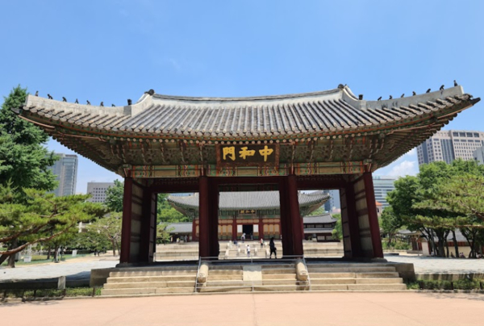

- **~17h45 – Balade Cheonggyecheon** 청계천 (rivière aménagée, ~1h15) – [Maps](https://maps.app.goo.gl/3CE6ixiu7mimtxhQ7)
> 🚶 *Depuis Deoksugung :* 5 min à pied

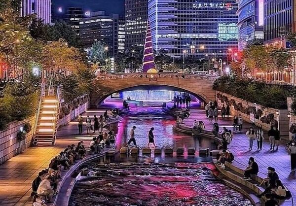

- **~19h – Myeongdong** 명동 shopping/street food en soirée – [Maps](https://maps.app.goo.gl/zu9eSr7MdGbjXtPb6)
> 📍 *Dans le quartier de l'hôtel*

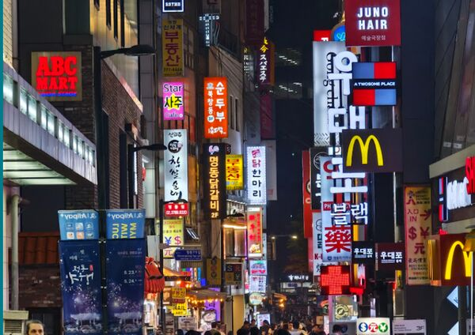

---

## Jour 2 – Séoul : Palais & quartiers historiques 🏯

> 💡 **Conseil :** Réserver le Jardin Secret à l'avance (places limitées — tour anglais 10h30 ou 14h30 sur le site Changdeokgung)

### Matin (8h-12h30)

- **8h15 – Gyeongbokgung Palace** 경복궁 (9h-18h — **prendre le tour guidé 11h**, prévoir 2h30 total) – [Maps](https://maps.app.goo.gl/bH7zuPrYoqqxAaqG9)
> 🚇 *Depuis hôtel :* Ligne 4 사호선 명동 → 충무로 · Ligne 3 삼호선 → 경복궁 · **12 min · 1 550 ₩ (~€1.10)**

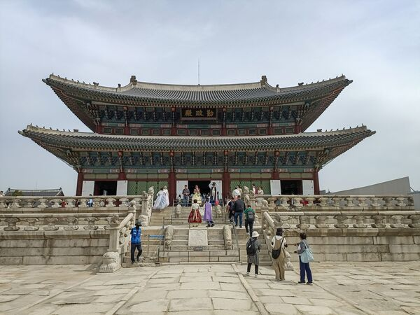

- **9h – Bukchon Hanok Village** 북촌한옥마을 (**y aller avant 10h pour éviter la foule**, 45 min–1h) – [Maps](https://maps.app.goo.gl/aM2wLPMa5wGUTNK69)
> 🚇 *Depuis Gyeongbokgung :* Ligne 3 삼호선 경복궁 → 안국 Anguk · **2 min + 9 min à pied · 1 550 ₩ (~€1.10)** — retour à Gyeongbokgung : marche 15 min ou Ligne 3

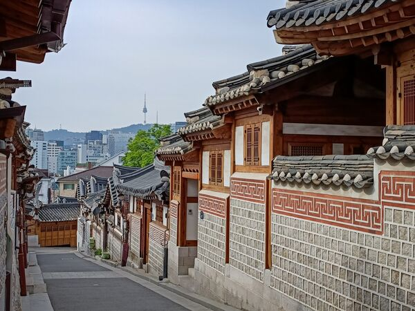

### Après-midi (13h30-17h15)

- **13h30 – Changdeokgung + Jardin Secret** 창덕궁 비원 (9h-17h, prévoir 2h30–3h, jardin +3€ — **tour anglais 14h30 recommandé**) – [Maps](https://maps.app.goo.gl/S9ai6un3Ki1Va6516)
> 🚶 *Depuis Bukchon :* 10–15 min à pied

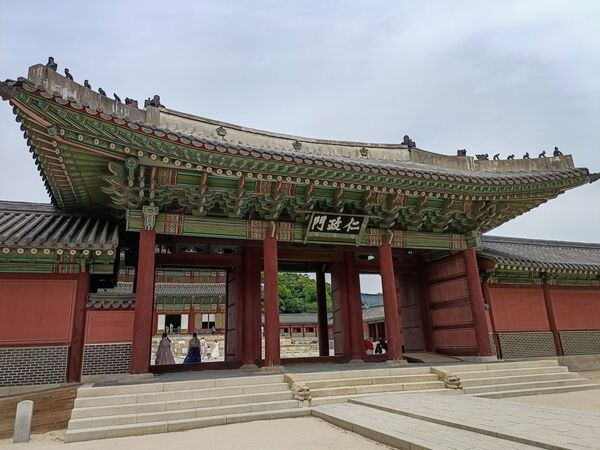

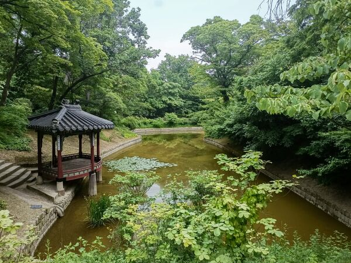

### Soirée (17h15-20h30)

- **17h15 – Insadong** 인사동 – quartier artisanat, salons de thé, rue piétonne (~1h) – [Maps](https://maps.app.goo.gl/TywkZPmCU3dWEL8MA)
> 🚌 *Depuis Changdeokgung :* Bus **151** 창덕궁 → 조계사.종로경찰서 · **16 min · 1 500 ₩ (~€1)**

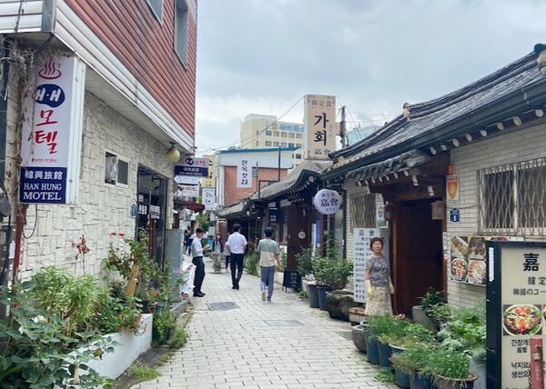

- **18h30 – Ikseon-dong Hanok Village** 익선동 – quartier branché, cafés, restaurants dans hanoks (~1h30) – [Maps](https://maps.app.goo.gl/9y8Hw1TyEk7i5cF57)
> 🚶 *Depuis Insadong :* 10 min à pied

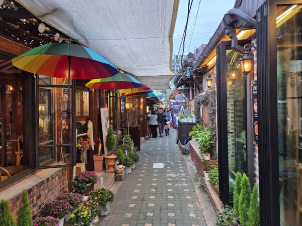

---

## Jour 3 – Excursion Suwon + Séoul 🏰

### Matin (7h-13h) – Suwon

- **8h15 – Forteresse de Suwon** 수원화성 (UNESCO) – **tour partiel ~2h** (secteur nord : tours Hwahongmun + Banghwasuryujeong)
> 🚇 *Depuis hôtel, départ 7h :* Seoul Station 서울역 → Ligne 4 사호선 → 금정 Geumjeong · Ligne 1 일호선 → 수원 Suwon · **60 min · 2 150 ₩ (~€1.50)**

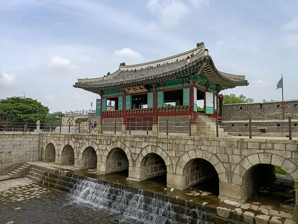

- **10h15 – Palais Hwaseong Haenggung** 화성행궁 (9h-17h, ~1h15) – [Maps](https://maps.app.goo.gl/9aFpvM43vHLgQhP76)
> 🚶 *Depuis la forteresse :* 10 min à pied (à l'intérieur du site)

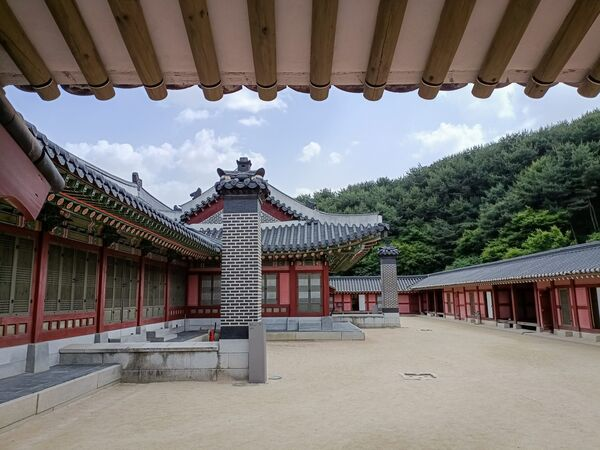

- **11h30 – Village mural Haenggungdong** 행궁동벽화마을 (street art, 30min) – [Maps](https://maps.app.goo.gl/bGCqQ6CQiXfVW68H9)
> 🚶 *Depuis le palais :* 5 min à pied

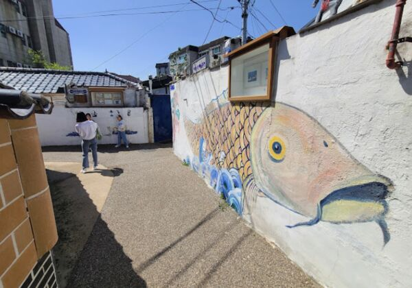

### Après-midi / Soirée (14h45-20h) – Retour Séoul

- **14h45 – N Seoul Tower / Namsan** 남산 – randonnée légère montée + vue depuis l'esplanade (extérieur de la tour, **gratuit**, ~2h total) – [Maps](https://maps.app.goo.gl/ji59aRei3kdFY4WYA)
> 🚇🚌 *Depuis Suwon (départ 13h) :* Ligne 1 일호선 → 서울역 Seoul Station (61 min) · Bus **402** 서울역버스환승센터 → 후암약수터 Huam (12 min) + 7 min à pied · **~82 min · 2 250 ₩ (~€1.55)**

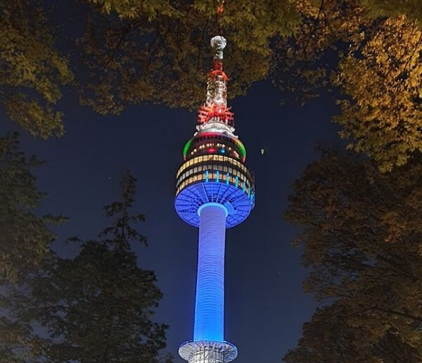

- **18h – Dongdaemun Design Plaza** 동대문역사문화공원 – architecture futuriste, lieu de tournage (~45min) – [Maps](https://maps.app.goo.gl/SZ3s2jMTcU6PLmdb6)
> 🚌🚇 *Depuis N Seoul Tower :* Bus **01A** 남산서울타워 → 소공동주민센터 Sogong-dong (13 min) · Ligne 2 이호선 시청 → 동대문역사문화공원 DDP (7 min) · **30 min · 1 550 ₩ (~€1.10)**

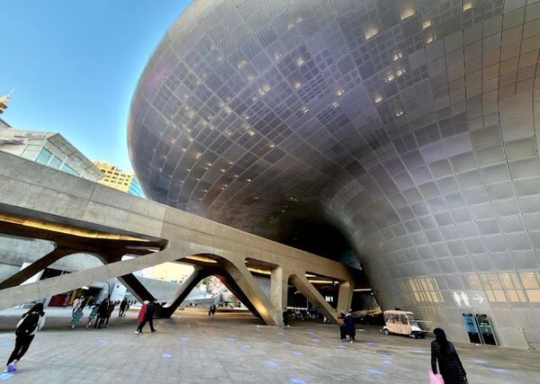

- **18h45 – Heunginjimun** 흥인지문 – porte fortifiée + balade remparts (~45min) – [Maps](https://maps.app.goo.gl/e2beNwQMj3FNH7AV9)
> 🚶 *Depuis DDP :* 5 min à pied

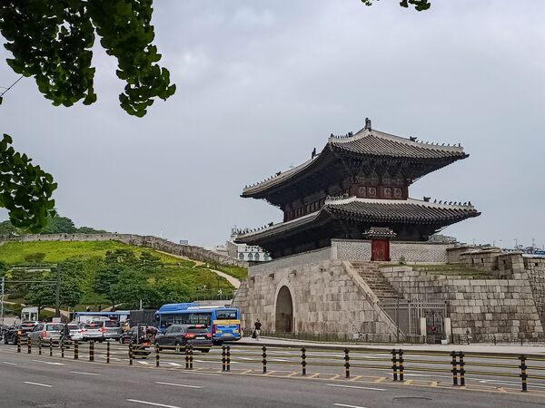

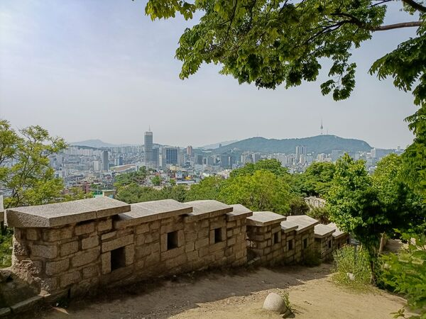

---

## Jour 4 – Séoul : Gangnam & K-pop 🎤

> **Optionnel – HYBE Insight** 하이브인사이트 (musée immersif BTS/HYBE, Yongsan 용산역) : si réservé, **démarrer la journée ici avant Gangnam**.
> - 📍 Adresse : 서울 용산구 한강대로 42 · Sortie 1 용산역 Yongsan Station + 5 min à pied
> - 🕙 Horaires : **10h–18h (dernière entrée 17h) · fermé lundi**
> - 🎫 Entrée : **₩22 000 (~15€/pers)** · **Réservation obligatoire** sur [Weverse Shop](https://shop.weverse.io) — souvent sold out **2–4 semaines à l'avance**, réserver dès que le voyage est confirmé
> - 🚇 *Depuis hôtel (départ 8h30) :* Ligne 4 사호선 명동 → 서울역 Seoul Station · Ligne 1 일호선 → 용산역 Yongsan · **~20 min · 1 550 ₩ (~€1.10)** → visite 9h–11h → puis Gangnam (Ligne 1 → 노량진 → Ligne 9 → 신논현, **~30 min**), arrivée COEX ~11h30
> - ⚠️ Si HYBE le matin : sauter K-Star Road + Sculpture Gangnam Style pour compenser le décalage horaire — COEX à 11h30, Bongeunsa 13h, Jamsil à 14h30 (encore faisable)

### Matin (9h-13h) – Gangnam

- **9h – K-Star Road** 케이스타로드 – œuvres d'art, empreintes de mains des stars K-pop (~30min) – [Maps](https://maps.app.goo.gl/NkR1oz9teZjxbWbw6)
> 🚇 *Depuis hôtel :* Ligne 4 사호선 명동 → 충무로 · Ligne 3 삼호선 → 교대 · Ligne 2 이호선 → 강남 · **29 min · 1 550 ₩ (~€1.10)**

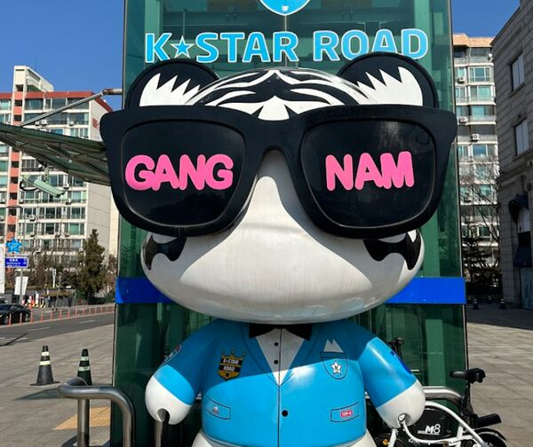

- **9h30 – Gangnam Style Sculpture** 강남스타일조형물 – [Maps](https://maps.app.goo.gl/kgA24BgD164PasU36)
> 🚶 *Depuis K-Star Road :* 5 min à pied

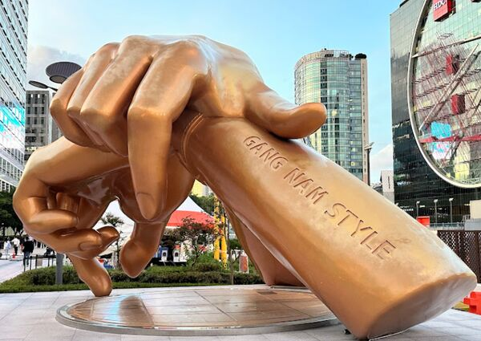

- **10h – COEX Mall / Starfield Library** 별마당도서관 – bibliothèque spectaculaire dans centre commercial (~45min) – [Maps](https://maps.app.goo.gl/T7EZenXB9CKKa8AU6)
> 🚶 *Depuis sculpture :* 10 min à pied

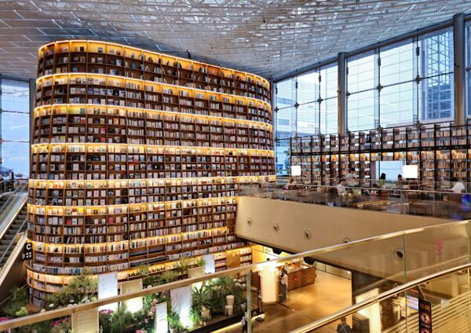

- **11h00 – Temple Bongeunsa** 봉은사 (contraste urbain/spirituel, ~1h) – [Maps](https://maps.app.goo.gl/xWfR1wwPNudNBbEM6)
> 🚶 *Depuis COEX :* 5 min à pied

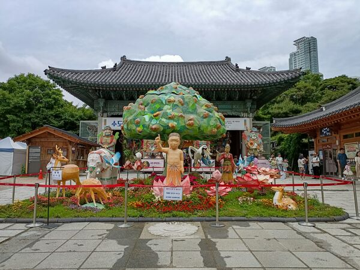

### Après-midi (13h-15h) – Jamsil

- **13h – Seoul Sky Tower** 서울스카이 (Lotte World Tower) – 5ème tour la plus haute du monde (~2h, pont ~70€/2, réserver en avance) – [Maps](https://maps.app.goo.gl/XMsnMrvpunyuQaLg7)
> 🚇 *Depuis Gangnam (départ 13h30) :* Ligne 2 이호선 강남 → 잠실 Jamsil direction 성수 · **15 min · 1 550 ₩ (~€1.10)**

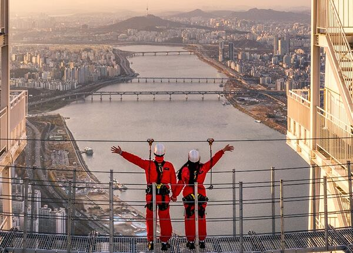

> **Optionnel – SM Entertainment Communication Center** 에스엠 커뮤니케이션센터 (Seongsu 성수) : expositions, produits officiels aespa/NCT/EXO/RIIZE, photo ops (~1-2h, **gratuit**)
> 🚇 *Depuis Jamsil :* Ligne 2 이호선 잠실 → 성수 Seongsu · **2 arrêts, ~6 min** — puis rejoindre Hongdae : Ligne 2 성수 → 홍대입구 Hongik Univ · **~22 min** (pas de détour majeur, sur la même ligne)

### Soirée (15h30-20h) – Hongdae

- **17h45 – Hongdae** 홍대 – street art, musique live, K-pop goods shops, ambiance nocturne (~4h) – [Maps](https://maps.app.goo.gl/ojTsa7JVKiGX7ugSA)
> 🚇 *Depuis Jamsil (départ 17h) :* Ligne 2 이호선 잠실 → 홍대입구 Hongik University direction 신촌 · **43 min · 1 750 ₩ (~€1.20)**
> *(Si SM Seongsu fait avant : départ Seongsu 17h15 → Hongdae 17h40)*

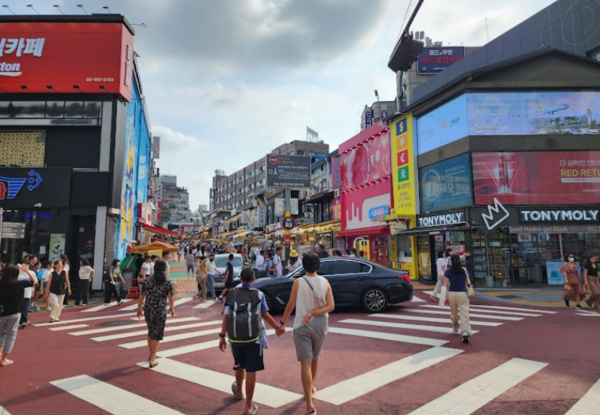

- **K-pop goods shops Myeongdong / Hongdae & K-Mecca** — À Myeongdong : grandes enseignes multi-étages avec albums officiels, photocards, lightsticks de toutes les agences. Point de repère concret : **K-Mecca 본점** 케이메카 명동본점 (📍 서울 중구 명동8나길 5 — à ~80m de la rue piétonne principale, dans le quartier de l'hôtel) — boutique physique multi-marques spécialisée K-pop, une des mieux fournies de Myeongdong. Antenne également à Dongdaemun (현대시티아울렛). À Hongdae : atmosphère plus indie, nombreux spots de photocard trading entre fans, seconde main. Les deux zones ont des dizaines de boutiques concentrées, pas besoin de chercher longtemps.
> 🚇 Depuis Hongdae, retour hôtel Myeongdong : 공항철도 AREX 홍대입구 → 서울역 Seoul Station (~10 min) · Ligne 4 서울역 → 명동 Myeongdong (1 arrêt, ~2 min) · ~20 min total · 1 550 ₩ (~€1.10)

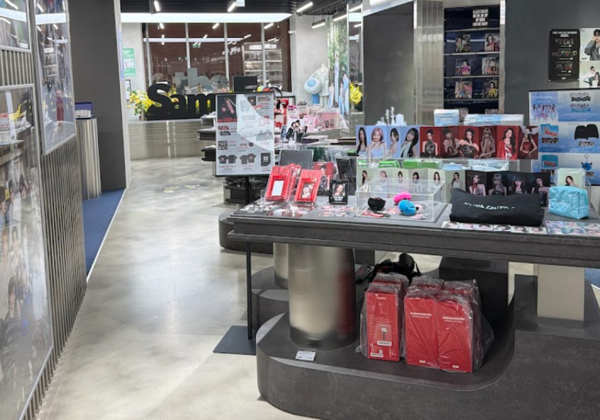

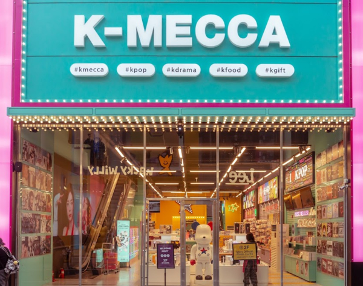

---

## Jour 5 – Séoul : Randonnée Bukhansan + culture 🥾

### Matin (6h30-12h30) – Départ tôt

- **8h – Parc national Bukhansan** 북한산국립공원 · **entrée gratuite** · 3 options au choix :

  **Option A — Baegundae 백운대 (836m)** ⭐ recommandé
  Sommet le plus haut et le plus iconique de Bukhansan. Montée dans la vallée Ui avec escaliers de pierre, passage par le **temple Insuam** 인수암 (source d'eau naturelle, chats — enlever les chaussures pour entrer), puis refuge **Baegunsan** 백운산장 (bancs, derniers WC avant le sommet). Après la porte **Baegunbong Ammun** 백운봉암문 : scramble sur dôme de granit avec **mains courantes et cordes fixes** — gants recommandés. **8.7km aller-retour · D+ 745m · montée ~2h · total ~3h30-4h**
  > 🚇 *Depuis hôtel, départ 6h30 :* Ligne 4 명동 → 성신여대입구 · LRT 우이신설경전철 → 북한산우이 Bukhansan Ui · **~45 min · 1 650 ₩ (~€1.15)**
  > 💡 Taxi/Uber depuis la station Ui jusqu'au trailhead (Baegundae Visitor Center) : économise 30-40 min de marche sur route
  > 🗺️ [Tracé & photos AllTrails (4.8⭐)](https://www.alltrails.com/trail/south-korea/bukhansan-national-park/bukhansan-ui-insuam-baegundae-peak)

  C'est LE sommet iconique de Bukhansan (3 338 photos AllTrails vs 950 pour Dobongsan) — le plus représenté, le plus photographié. Vue panoramique à 360° sur Séoul depuis le dôme de granit.

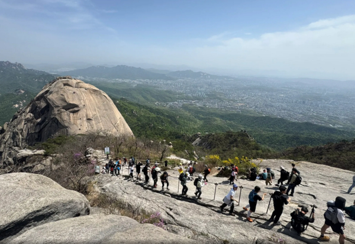

  **Option B — Dobongsan 도봉산 (740m)**
  Massif voisin au granit spectaculaire, temples bouddhistes sur le chemin. Section finale : **scramble quasi-vertical sur paroi de granit avec câbles métalliques fixes** — plus technique que Baegundae. Vue 360° sur le nord de Séoul et les pics voisins. **6.9km aller-retour · D+ 643m · total ~3h30**
  > 🚇 *Depuis hôtel, départ 6h30 :* Ligne 1 또는 7 → 도봉산역 Dobongsan Station · **~35 min · 1 650 ₩ (~€1.15)**
  > 🗺️ [Tracé & photos AllTrails (4.7⭐)](https://www.alltrails.com/trail/south-korea/seoul/bukhansan-national-park/dobongsan-mountain)

  Pourquoi pas B (Dobongsan) ? Plus technique que Baegundae (scramble avec câbles vs chaînes sur rocher), moins fréquenté, mais aussi moins iconique. Bon choix si tu veux une section d'escalade plus engagée.

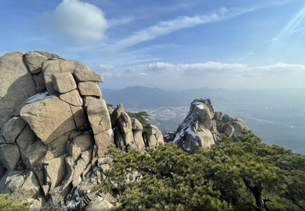
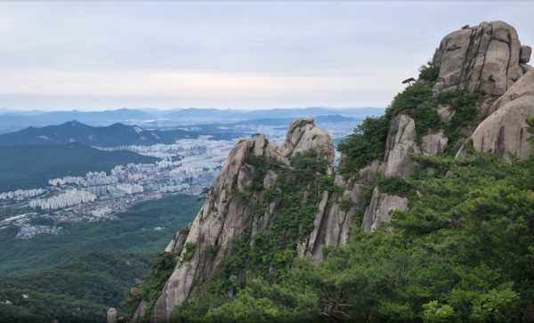

  **Option C — Forteresse Bukhansanseong 북한산성**
  Montée raide le long des remparts Joseon (XVIIe siècle) — escaliers de pierre et single-tracks en forêt de pins coréens — jusqu'au **pic Mangyeongdae** avec vue panoramique sur tout Séoul et vue rapprochée sur Baegundae. Difficile, terrain rocheux. Magnifique en automne. **10.3km aller-retour · D+ 678m · 4.5-5h · difficile**
  > 🚇 *Depuis hôtel, départ 6h30 :* Ligne 3 → 구파발 Gupabal · bus vers entrée forteresse · **~45 min · 1 650 ₩ (~€1.15)**
  > 🗺️ [Tracé & photos AllTrails (4.7⭐)](https://www.alltrails.com/trail/south-korea/bukhansan-national-park/bukhansanseong-fortress-entrance-yong-ammun-mangyeongdae)

  Pourquoi pas C (Bukhansanseong) ? Profil similaire à A et B en termes d'effort (678m D+, ~5h), mais l'intérêt est différent : remparts historiques + vue sur Baegundae depuis Mangyeongdae plutôt que depuis le sommet lui-même. Bon choix si la dimension culturelle/fortifiée t'attire autant que le panorama.

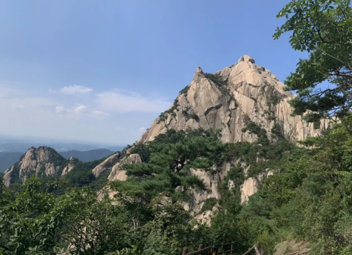


### Après-midi (14h-19h)

- **14h15 – Jogyesa Temple** 조계사 – principal temple bouddhiste de Séoul (~45min) – [Maps](https://maps.app.goo.gl/Av5mPQkSUNmL65m69)
> 🚇🚌 *Depuis Bukhansan (départ ~13h) :* LRT 우이신설경전철 → 정릉 Jeongneung (13 min) · Bus **162** 정릉입구 → 안국동 Anguk-dong (20 min) · **~64 min · 1 650 ₩ (~€1.15)**

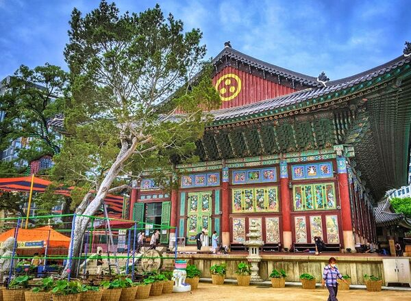

- **16h – Gwangjang Market** 광장시장 – street food traditionnelle, ambiance locale + Pojangmacha 포장마차 (tentes street food) (~1h30) – [Maps](https://maps.app.goo.gl/W4ERKKVMJHCb3vBQ8)
> 🚌 *Depuis Jogyesa :* Bus **370** 종로1가 Jongno 1-ga → 종로5가.광장시장 · **17 min · 1 500 ₩ (~€1)**

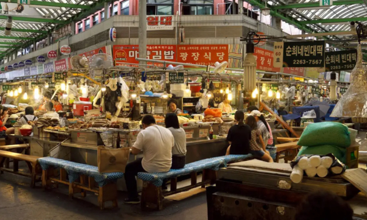

---

## Jour 6 – Séoul → Sokcho / Seoraksan 🏔️

**Trajet** : Bus express Séoul → Sokcho (~2h20, départ ~7h30, arrivée ~9h50)

> 🚌 *Départ hôtel 6h45 :* Métro Ligne 3/7/9 → 고속터미널 Express Bus Terminal · puis bus 서울→속초 · **~140 min · réserver sur KOBUS (kobus.co.kr)**

### Après-midi (11h-17h) – Seoraksan

- **11h30 – Gwongeumseong** 권금성 – Ruines de la forteresse Joseon à 700m d'altitude, accessibles par le **Sorak Cable Car** (설악산 케이블카). Vue panoramique sur les pics granitiques de Seoraksan, la mer de l'Est et la ville de Sokcho par temps clair. Au sommet : plateforme d'observation + courte marche sur les ruines rocheuses (~20-30 min). **~1h30 total**
  - 💴 **₩16 000 (~€11)/adulte · ₩12 000 (~€8.30)/enfant** (aller-retour uniquement) · pas de réservation en ligne — billetterie sur place uniquement
  - ⏱️ Trajet ~5 min · Attente variable : courte hors saison, **très longue en automne** (foliage) → arriver tôt
  - ⚠️ Dépend de la météo — câble suspendu par vent fort
  - 🔗 [Guide complet](https://heyseorak.com/blog/seoraksan-cable-car-guide) · [VisitKorea](https://english.visitkorea.or.kr/svc/whereToGo/locIntrdn/rgnContentsView.do?vcontsId=97439) . [photos](https://www.tripadvisor.fr/Attraction_Review-g317129-d3808277-Reviews-Gwongeumseong_Fortress-Sokcho_Gangwon_do.html)
> 🚌 *Depuis hébergement Sokcho :* bus vers l'entrée du parc (~15 min)

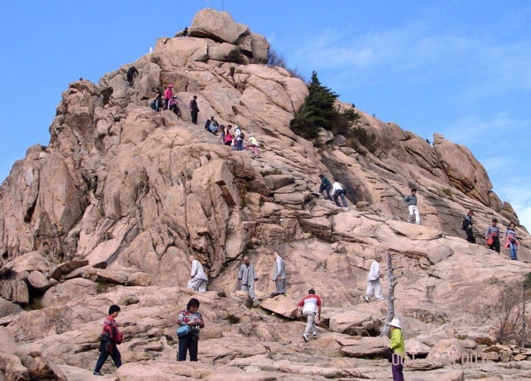

- **13h30 – Biseondae** 비선대 – Sentier facile le long de la rivière Seorakcheon jusqu'à un grand rocher de granit poli gravé de poèmes anciens — selon la légende, une fée serait montée au ciel depuis cet endroit. Chemin en forêt ombragée et bord de rivière, très paisible. **5.8km aller-retour · D+ 158m · 1h30-2h**
  - **Extension : Grotte Geumganggul** 금강굴 (⭐ recommandé, +1.3km · +0.5-1h) — chemin raide depuis Biseondae avec escaliers métalliques dans la roche, aboutit à une grotte-sanctuaire bouddhiste avec source naturelle. Vues spectaculaires sur la vallée. [AllTrails Geumganggul (4.8⭐)](https://www.alltrails.com/trail/south-korea/gangwon/geumganggul-trail)
  - 🗺️ [Tracé & photos AllTrails (4.6⭐)](https://www.alltrails.com/trail/south-korea/gangwon/biseondae-peak)
> 🚶 *Depuis téléphérique :* 10 min à pied vers l'entrée du sentier

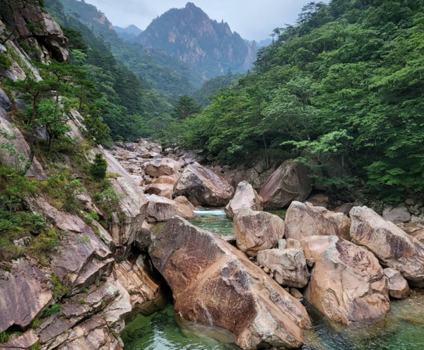

### Soirée (17h-20h) — au choix

  **Option 1 — Abai Village** 아바이마을 ⭐ recommandé · ~1h30
  Village fondé par des réfugiés nord-coréens après la guerre de Corée (1950-53), isolé sur une langue de terre entre la mer et le lac Cheongchoho. Accès par le **gaetbae** (갯배) — un petit bac à câble sans moteur tiré à la main par les passagers eux-mêmes (~5 min de traversée). Sur place : murales racontant l'exode des réfugiés, boutiques et restaurants spécialisés en cuisine nord-coréenne — calmars farcis **오징어순대** et crabe des neiges. [Photos](https://www.koreabybike.com/routes/gangwon-bicycle-path/highlights/abai-village/)
  - 💴 Gaetbae **₩500 (~€0.35)/trajet** (aller-retour ₩1 000 (~€0.70)) · Horaires : 5h-23h
  > 🚌 *Depuis Seoraksan :* Bus **7 ou 9** → dock gaetbae · **39 Jungangbudu-gil, Sokcho** · ~20 min

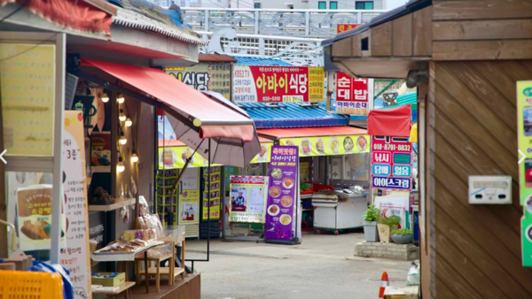

  **Option 2 — Yeonggeumjeong + Plage de Sokcho** 영금정 · Gratuit · ~1h30
  Pavillon coréen posé sur un promontoire rocheux face à la mer de l'Est — l'un des meilleurs spots coucher de soleil de Sokcho. Horizon dégagé, vagues sur les rochers, lumière orangée sur la côte. La **plage de Sokcho** 속초해수욕장 est à 10 min à pied pour prolonger la balade.
  - 💴 Entrée gratuite
  > 🚌 *Depuis Seoraksan :* Bus **1/3/7/9** → arrêt Yeonggeumjeong + 9 min à pied · **43 Yeonggeumjeong-ro, Dongmyeong-dong** · ~20 min

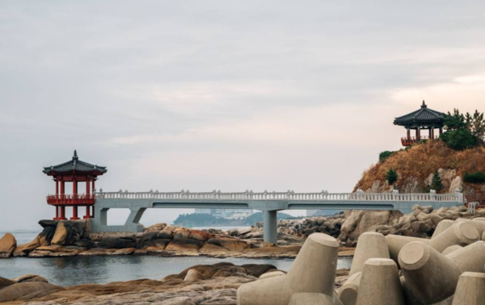

---

## Jour 7 – Seoraksan : Randonnée Ulsanbawi 🧗

### Matin (6h30-13h) – Départ tôt

- **7h20 – Sinheungsa** 신흥사 – **entrée gratuite** · ~20 min
  Temple bouddhiste fondé en 653 ap. J.-C. par le moine Jajang — l'un des plus anciens temples Zen au monde. Incendié et reconstruit plusieurs fois, l'édifice actuel date de 1648. À l'entrée : le **Tongildaebu** 통일대불, immense Bouddha en bronze doré de **14.6m** (18.9m avec le socle, 108 tonnes), dédié à la réunification des deux Corées — financé par les dons de 300 000 anonymes sur plus d'une décennie.
> 🚌 *Depuis hébergement Sokcho, départ 6h30 :* bus vers l'entrée du parc (~15 min) · **entrée parc national gratuite** .  [Photos](https://www.tripadvisor.fr/Attraction_Review-g317129-d3805406-Reviews-Sinheungsa_Temple-Sokcho_Gangwon_do.html)

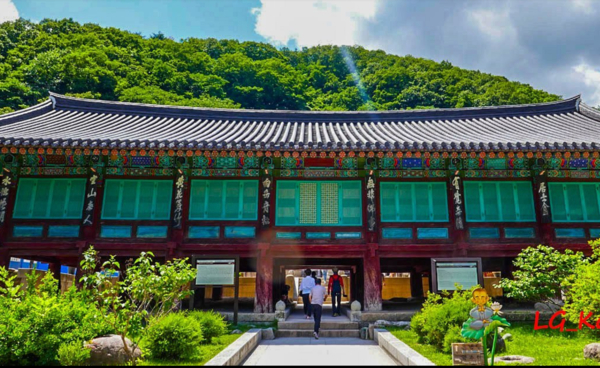

- **7h45 – Randonnée Ulsanbawi Rock** 울산바위 – ⭐ clou du séjour à Seoraksan
  Formation de 6 pics de granit à 873m — l'une des silhouettes les plus iconiques de Corée. **7.4km aller-retour · D+ 566m · 3.5-4h**
  - **Section 1** (depuis Sinheungsa) : large chemin semi-pavé en forêt, pente douce — la vraie rando commence au niveau de **Heundeulbawi** 흔들바위 (rocher oscillant de 16 tonnes, curiosité géologique à ne pas manquer)
  - **Section 2** (dernier 1km) : **808 marches** taillées dans la paroi de granit, raide mais sécurisé — le cœur de la rando
  - **Au sommet** : 3 plateformes d'observation dans 3 directions — mer de l'Est à l'est, crêtes de Seoraksan à l'ouest, formation d'Ulsanbawi vue de face. Vue à 360° par temps clair
  - Fin septembre/début octobre : début des couleurs automnales sur les pentes, températures idéales
  - 🅿️ Parking payant (entrée parc) · 🚻 Toilettes avant Heundeulbawi
  - 🗺️ [Tracé & photos AllTrails (4.8⭐)](https://www.alltrails.com/trail/south-korea/gangwon/ulsanbawi-trail)
> 🚶 *Depuis Sinheungsa :* 5 min à pied · départ tôt recommandé pour éviter les foules

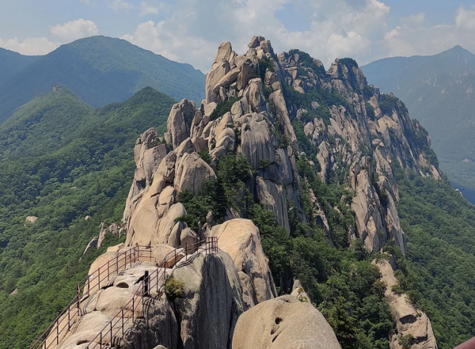

### Après-midi (13h30-18h)

- **13h30 – Plage de Sokcho** 속초해수욕장 – détente / baignade, balade front de mer
> 🚌 *Depuis Seoraksan :* bus retour → Sokcho centre (~15 min)

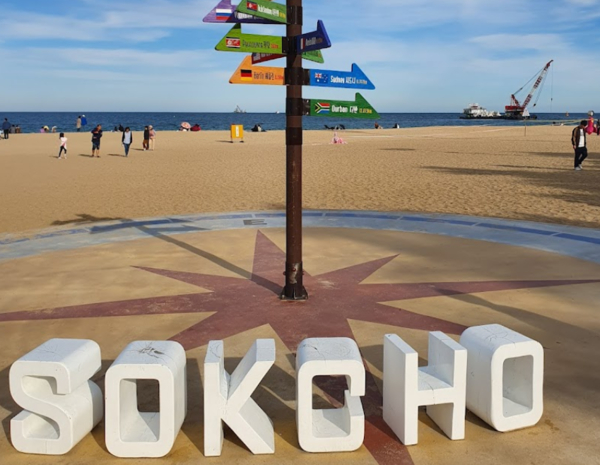

- Option 3 — Cheoksan Hot Spring** 척산온천 Zone thermale en périphérie de Sokcho. Bain de pieds en plein air (**footbath park**) dans une eau à 50°C riche en sodium et soufre — parfait pour récupérer après une journée de rando. L'accès au footbath est gratuit ou quasi-gratuit (₩1 000 / ~€0.70) ; spa intérieur et bains privés disponibles en supplément. [Avis/Photos](https://www.tripadvisor.fr/Attraction_Review-g317129-d7918004-Reviews-Cheoksan_Foot_Spa_Park-Sokcho_Gangwon_do.html)
  - 💴 Footbath **gratuit / ₩1 000 (~€0.70)** · Ouvert 24h/24
  > 🚌 *Depuis Sokcho centre :* Bus **3 ou 3-1** → 5 min à pied · **327 Gwangwang-ro, Sokcho** · ~20 min depuis Seoraksan

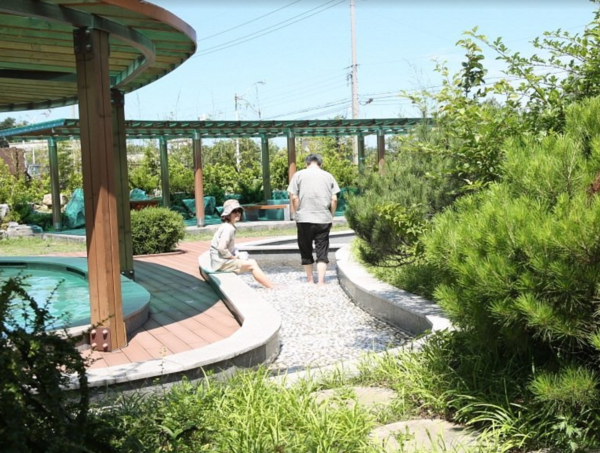

---

## Jour 8 – Sokcho → Séoul (repos + activité au choix) 🚌

**Trajet** : Bus express Sokcho → Séoul (~2h20, départ ~8h, arrivée ~10h20)

> 🚌 *Départ 8h :* 속초고속버스터미널 Sokcho → 서울고속버스터미널 Seoul Express Bus Terminal · **~140 min** · Arrivée station 고속터미널 (Ligne 3/7/9) → Myeongdong 15 min supplémentaires

### Après-midi (11h30-18h) – Activité au choix selon envie/fatigue :
- **Changgyeonggung Palace** 창경궁 (9h-21h, fermé lundi) — à faire si le jour 2 Changdeokgung était chargé – [Maps](https://maps.app.goo.gl/rEHcUpouJJAXN7179) [info](https://www.tripadvisor.fr/Attraction_Review-g294197-d1554603-Reviews-Changgyeonggung_Palace-Seoul.html)
- **HYBE Insight** 하이브인사이트 (musée BTS/HYBE, Yongsan) – 2h, réservation obligatoire [info](https://www.tripadvisor.fr/Attraction_Review-g294197-d23508189-Reviews-HYBE_INSIGHT-Seoul.html)
- **SM Communication Center** (Seongsu 성수, gratuit) – 1-2h, expositions aespa/NCT/EXO/RIIZE [info](https://www.tripadvisor.fr/Attraction_Review-g294197-d14202347-Reviews-SM_ENTERTAINMENT_Communication_Center-Seoul.html)
- **National Museum of Korea** 국립중앙박물관 (gratuit) – 3h [info](https://www.tripadvisor.fr/Attraction_Review-g294197-d325043-Reviews-National_Museum_Of_Korea-Seoul.html)
- Ou simplement flâner dans un quartier non encore exploré

---

## Jour 9 – Excursion Jeonju (journée) 🍚

**Trajet aller** : KTX Séoul (Yongsan) → Jeonju (~1h26–1h50 selon train, départ ~8h, arrivée ~9h30)

> 🚄 *Départ hôtel 7h15, départ KTX 8h :* 서울역 Seoul Station → Ligne 1 → 용산역 Yongsan (3 min) → KTX 전주역 Jeonju Station · **~86 min · réserver sur korail.com/global/eng** · retour KTX ~19h → Seoul ~20h30

### Matin (10h-12h30)

- **10h – Jeonju Hanok Village** 전주한옥마을 – village culturel, maisons traditionnelles (~1h30) – [Maps](https://maps.app.goo.gl/gRJbTUH3ARCyPyEc8)
> 🚶 *Depuis la gare de Jeonju :* 20 min à pied ou taxi 5 min

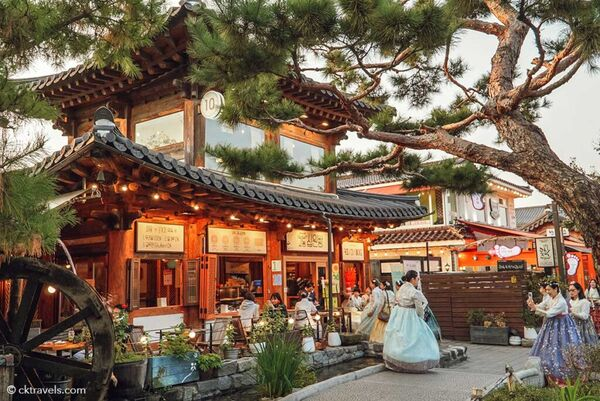

- **11h – Sanctuaire Gyeonggijeon** 경기전 (9h-18h, ~1h) – [Maps](https://maps.app.goo.gl/P3zocqQTamirQKVd8)
> 📍 *Dans le Hanok Village*

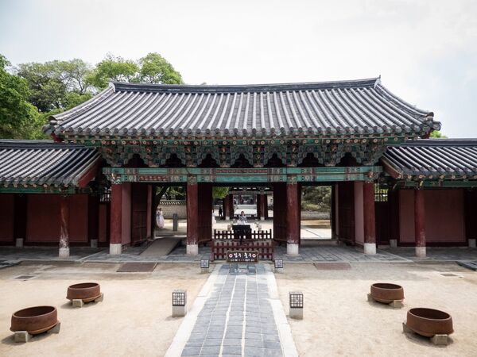

### Déjeuner (12h30)
- **Bibimbap** 비빔밥 – spécialité de Jeonju, à goûter absolument !

### Après-midi (14h-17h)

- **14h – Jaman Mural Village** 자만벽화마을 – street art (~1h30) – [Maps](https://maps.app.goo.gl/JPYBgCWoyDRSJBYs8)
> 🚶 *Depuis le quartier Hanok :* 10 min à pied

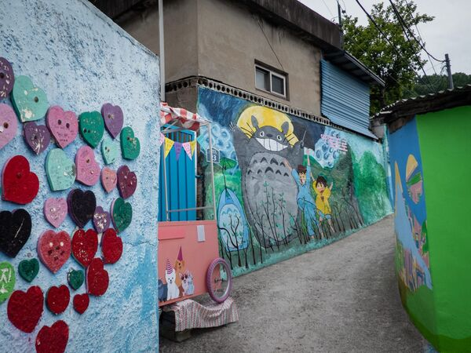

- **15h30 – Hanbyeokdang Pavilion** 한벽당 – lieu de tournage Twenty-Five Twenty-One (~1h) – [Maps](https://maps.app.goo.gl/61Rigy9auJsAPCjB8)
> 🚶 *Depuis Jaman :* 10 min à pied

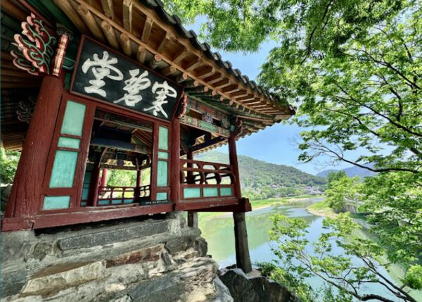

---

## Jour 10 – Séoul → Busan 🚄

**Trajet** : KTX Séoul → Busan (~2h18, départ ~8h30, arrivée ~10h50)

> 🚄 *Départ hôtel 7h45 · KTX 8h30 :* 서울역 Seoul Station → 부산역 Busan Station · **~138 min · réserver sur korail.com/global/eng** · arriver 30 min avant

### Après-midi (12h-17h)

- **12h28 – Gamcheon Culture Village** 감천문화마을 – village coloré, street art, vue sur mer (~2h30) – [Maps](https://maps.app.goo.gl/PEWwKJdWTjW5iBAi7)
> 🚌 *Depuis 부산역 Busan Station (check-in hôtel Nampodong d'abord) :* Bus **서구2-2** 부산역 → 감천문화마을.부산교육역사관 · **28 min · 1 050 ₩ (~€0.70)**

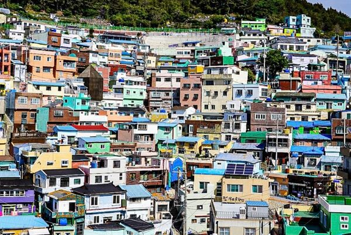

- **168 Stairs** + **Kim Min-Bu Observatory** – point de vue (même quartier, 30min)
> 📍 *Dans Gamcheon*

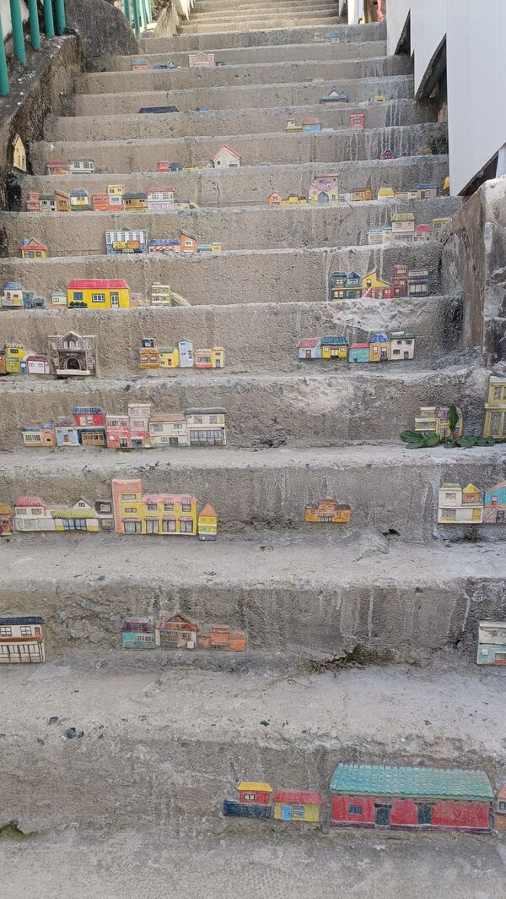

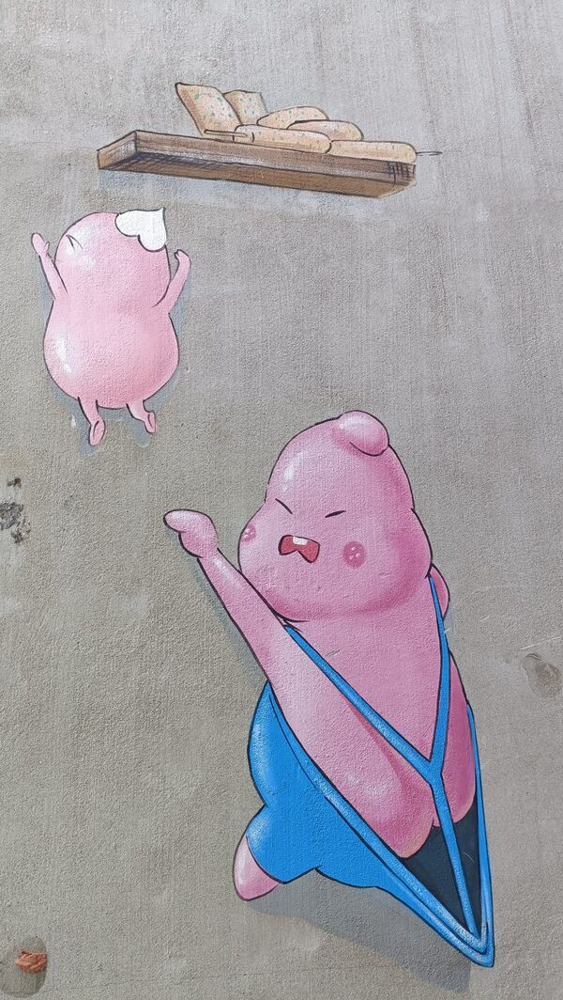

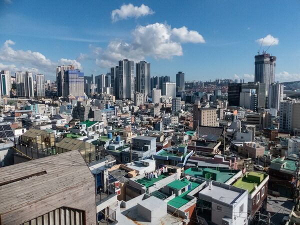

- **15h30 – Quartier BIFF / Nampodong** 비프광장 – quartier animé de Busan avec ses magasins de cosmétiques, street food, cafés et cinémas (~1h30) [info](https://www.tripadvisor.fr/Attraction_Review-g297884-d1605555-Reviews-BIFF_Square-Busan.html)
> 🚌 *Depuis Gamcheon :* Bus **서구2-2** retour → 부산역 (28 min) puis 10 min à pied vers Nampodong

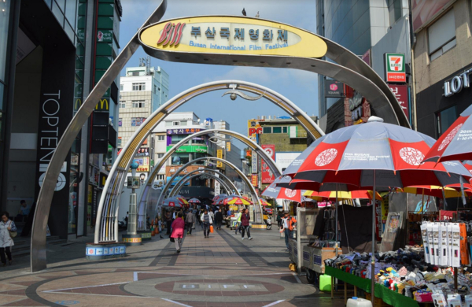

### Soirée (17h30-21h30)

- **17h30 – Plage Gwangalli** 광안리 + pont illuminé de nuit (~3h) – [Maps](https://www.google.com/maps?q=Gwangalli+Beach+Busan)
> 🚌 *Depuis Nampodong :* bus ou métro vers 광안리 Gwangalli (~20 min)

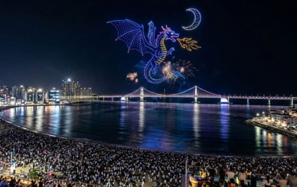

- Spectacle de drones 2 fois tous les **samedis** 20h et 22 (de mars à septembre) puis 19h et 21h entre octobre et février [info](https://french.visitkorea.or.kr/svc/contents/contentsView.do?vcontsId=199415)

---

## Jour 11 – Busan : Temples & côte 🌊

### Matin (7h30-13h)

- **8h52 – Temple Haedong Yonggungsa** 해동용궁사 – temple en bord de mer spectaculaire (~1h) – [Maps](https://maps.app.goo.gl/EXR9EiAz61drF2qX9)
> 🚌 *Depuis 부산역 Busan Station, départ 7h45 :* Bus **1001** (ou **1001 심야** de nuit) 부산역 → 용궁사.국립수산과학원 (55 min) + 10 min à pied · **67 min · 2 100 ₩ (~€1.45)** ⚠️ Bus 1001, pas le 1003

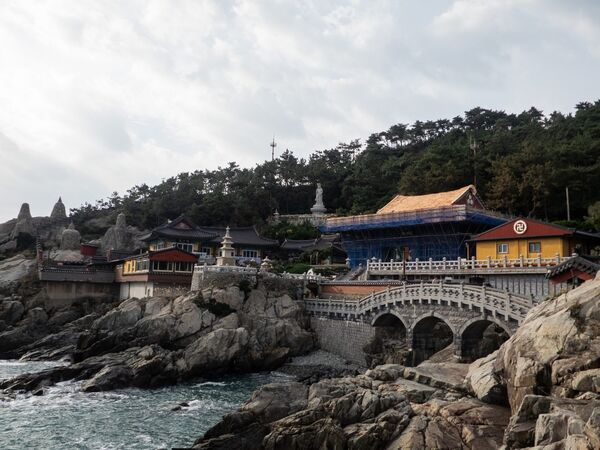

- **10h30 – Blue Line capsule** une capsule qui se déplace tout en admirant le mystérieux paysage côtier depuis un rail aérien
 - 블루라인파크 → Haeundae (~30min, ~20€/2, réserver en avance) – [Site](https://www.bluelinepark.com/eng/tourFacilityList.do)
> 🚕 *Depuis Haedong :* taxi → station Songjeong 송정역 (~15 min)


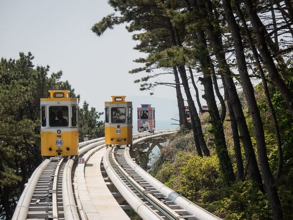

### Après-midi (11h-17h)

- **11h – Plage Haeundae** 해운대해수욕장 – balade, à droite pontons sur la mer (~2h) – [Maps](https://www.google.com/maps?q=Haeundae+Beach+Busan)
> 🚶 *Depuis l'arrivée Blue Line à Haeundae :* 5 min à pied

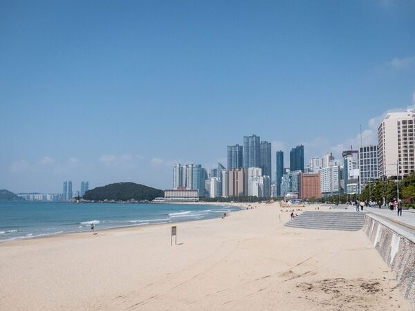

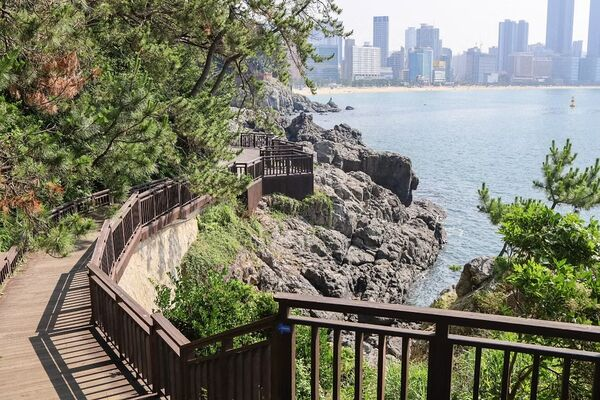

### Soirée (17h-20h)

- **17h – Coucher de soleil à Haeundae** + balade Dongbaek Island 동백섬 – presqu'île boisée à l'extrémité ouest de la plage (~45 min, gratuit)
> 🚶 *Depuis la plage Haeundae :* 5 min à pied vers l'ouest

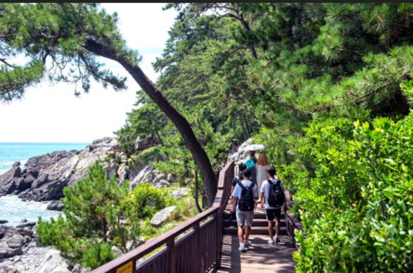

---

## Jour 12 – Excursion Gyeongju (journée complète) 🏛️

> 🚄 *Départ Busan 7h30 :* 부산역 Busan Station → KTX → 신경주역 Singyeongju · **27 min**
> 🚌 *Depuis Singyeongju :* Bus **1150** → 불국사 Bulguksa · **~62 min · 1 450 ₩ (~€1)** — ou taxi **~20 min (4 000–5 000 ₩ / ~€2.75–€3.45)** recommandé pour visiter aussi Seokguram

### Matin (9h-12h)

- **9h30 – Temple Bulguksa** 불국사 (UNESCO, 9h ouverture, ~1h, entrée 5€)
> 🚌🚕 *Depuis gare Singyeongju :* bus 1150 ~62 min ou taxi ~20 min

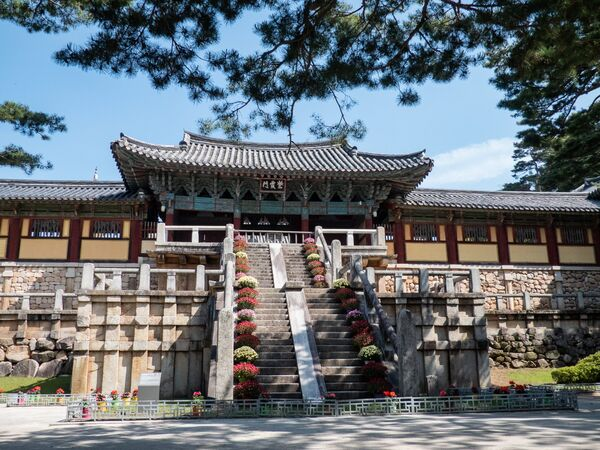

- **10h50 – Grotte Seokguram** 석굴암 (UNESCO, ~55min)
> 🚕 *Depuis Bulguksa :* taxi ~10 min

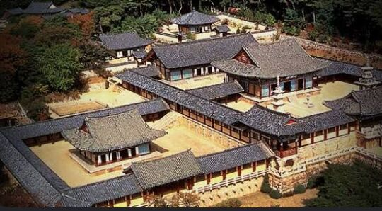

### Après-midi (13h-18h)

- **13h30 – Tumuli royaux Daereungwon** 대릉원 – paysage de tombes royales (~1h30)
> 🚕 *Depuis Bulguksa/Seokguram :* taxi → centre Gyeongju (~15 min)

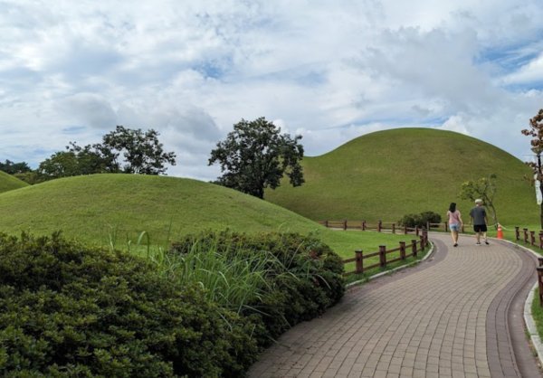

- **15h – Hwangnidan-gil** 황리단길 – rue boutiques, goûter le hotteok (crêpe au miel, ~1h)
> 🚶 *Depuis Daereungwon :* 5 min à pied

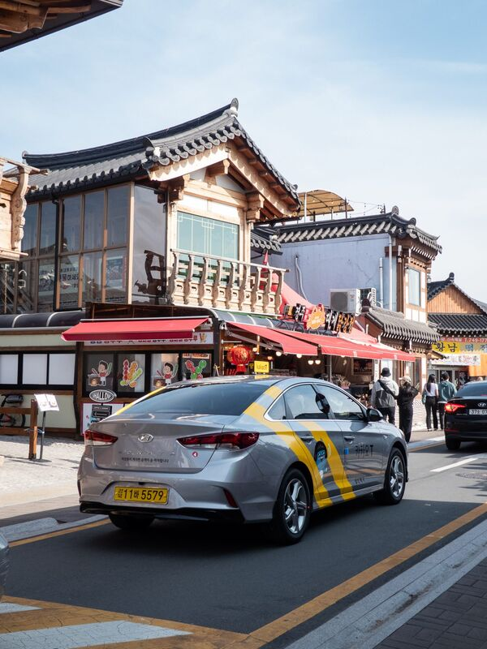

- **16h – Gyeongju Gyochon Traditional Village** 교촌마을 (~1h)
> 🚶 *Depuis Hwangnidan-gil :* 5 min à pied

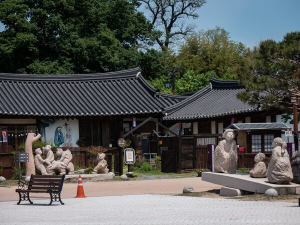

### Soirée (18h-21h30)

- **18h – Palais Donggung + Étang Wolji** 동궁과 월지 (magnifique de nuit, 2€, ~1h30) – [Maps](https://maps.app.goo.gl/JQfLXZM1DJ4Hh19bA)
> 🚶 *Depuis Gyochon :* 10 min à pied

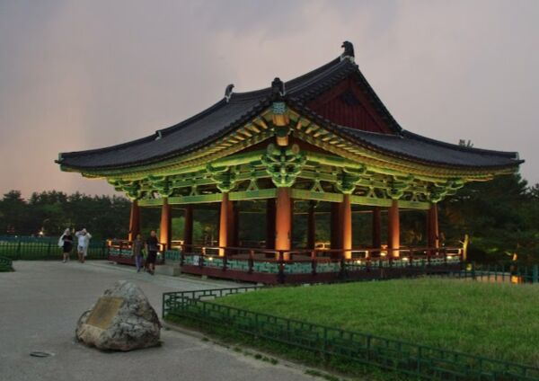

> 🚌🚄 *Retour Busan :* bus **1150** → 신경주역 Singyeongju (~62 min) + KTX → 부산역 Busan (~27 min) · dernier KTX ~22h

---

## Jour 13 – Busan : Randonnée côtière & Songdo 🥾

### Matin (7h30-12h30)

- **8h40 – Igidae Coastal Trail** 이기대해안산책로 – randonnée côtière ~3h, vues spectaculaires sur la mer et le pont Gwangalli
> 🚌 *Depuis 부산역 Busan Station, départ 7h45 :* Bus **27** 부산역 → 용호사거리 Yongho Sageori (36 min) + 15 min à pied · **53 min · 1 550 ₩ (~€1.10)**

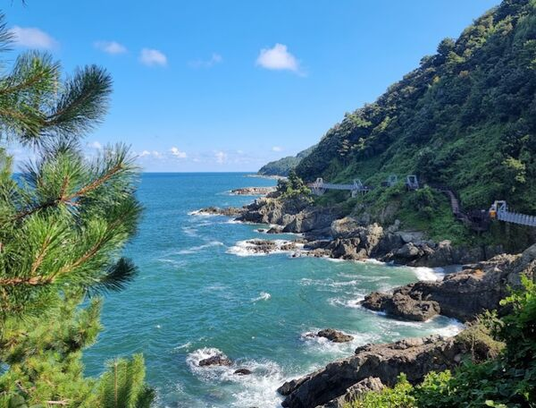

### Après-midi (13h30-17h)

- **13h30 – Téléphérique de Songdo** 송도해상케이블카 (ouvre 9h, ticket ~8€, ~1h) – [Maps](https://maps.app.goo.gl/aKC3zYEHoGF6KUAAA)
> 🚌 *Depuis Igidae (départ ~12h) :* Bus **남구9** 용호동경동아파트 → 동명대학교 (12 min) · Bus **3006** 동명대학교후문 → 송도입구 Songdo (22 min) · **~53 min · 2 100 ₩ (~€1.45)**

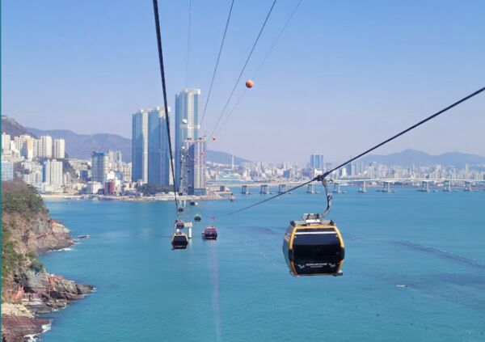

- **14h30 – Songdo Yonggung Suspension Bridge** 송도용궁구름다리 (~30min) – [Maps](https://maps.app.goo.gl/siJd794A9t4TcywF6)
> 🚶 *Depuis le téléphérique :* 5 min à pied

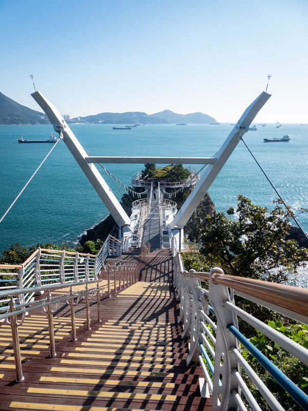

- Vue sur l'île de Dudo – [Maps](https://maps.app.goo.gl/2mPGjE9mZTHRMLCE9)

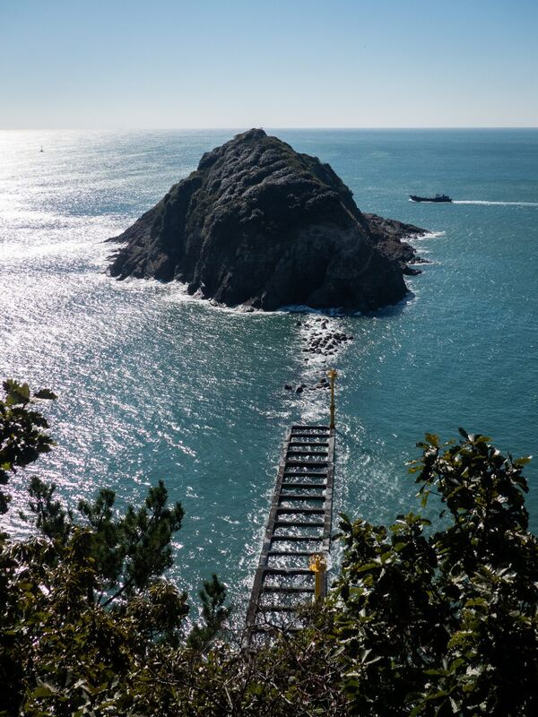

- **15h15 – Amnam Park** 암남공원 (~1h · gratuit)
  Parc côtier directement adjacent au pont suspendu. La **Songdo Coastal Bolle-gil** (송도해안산책로) est une passerelle rouge en acier de 800m construite sur les falaises reliant Amnam Park à la plage Songdo — vues sur la mer, falaises de grès vieilles de 100 millions d'ans avec fossiles d'empreintes de dinosaures. Forêt côtière, observatoires sur les rochers.
  - 🗺️ [Tracé AllTrails (22 avis)](https://www.alltrails.com/trail/south-korea/busan/amnam-park-coastal-trail)
> 🚶 *Depuis le pont suspendu :* accès direct à pied

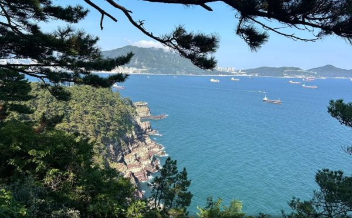

### Soirée (16h30-19h30)

- **16h30 – Hwangnyeong Mountain Observatory** 황령산전망대 – coucher de soleil (~1h30)
> 🚇 *Depuis Songdo :* métro → 연산역 Yeonsan ou 부산시민공원역 Busan Hall + petit bus vert sortie 6

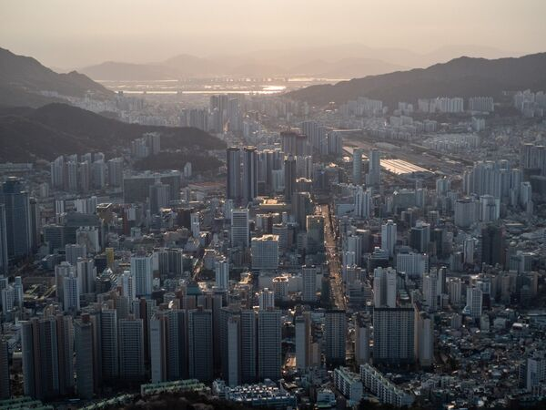

> **Optionnel :** Temple Beomeosa 범어사 (nord Busan, 30min métro) ou Hurshimchung Spa 허심청 (sources chaudes)

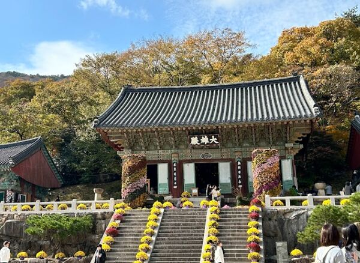

---

## Jour 14 – Busan → Jeju 🌋

> ✈️ *Vol matinal PUS→CJU (viser 8h–9h) :* Air Busan 에어부산, Jeju Air 제주항공, Jin Air 진에어 · **~60 min · 40 000–120 000 ₩ (~€27–€83)** · réserver sur site des compagnies ou Klook
> 🚗 *À l'arrivée Jeju :* récupérer voiture de location au terminal arrivées

### Après-midi (11h30-18h) – Secteur nord/est

- **11h30 – Plage Hamdeok** 함덕서우봉해변 – sable blanc, détente (~1h30) – [Maps](https://maps.app.goo.gl/xWkQMWBkTEvF7CEK8)
> 🚗 *Depuis aéroport Jeju (après retrait voiture, ~10h45) :* ~20 min de route

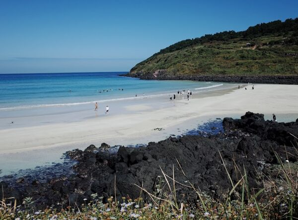

- **14h – Red Horse Lighthouse** 붉은오름자연휴양림 (~30min) – photo
> 🚗 *Depuis Hamdeok :* ~15 min de route

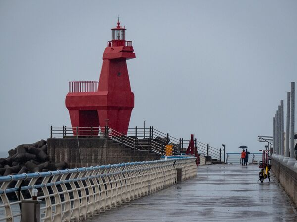

### Soirée (~16h)
- 🚗 Route vers Jeju-si (~20 min) · check-in hôtel · balade/dîner Jeju-si

---

## Jour 15 – Jeju : Est & volcans 🌅

### Matin (7h-13h) – Secteur est

- **8h – Seongsan Ilchulbong** 성산일출봉 (UNESCO) – Cône volcanique de 182m surgit de la mer il y a ~5 000 ans. Au sommet : cratère herbeux de **600m de diamètre** entouré de roches jagged — vue sur l'océan à 360° et sur la côte est de Jeju. Escaliers pavés quasi intégralement (montée ~15-20 min).
  - **1.8km boucle · D+ 142m · 0.5-1h**
  - 💴 **₩5 000 (~€3.50)/adulte** · Horaires : 7h-19h
  - Arriver tôt : très fréquenté en milieu de matinée, brouillard fréquent
  - 🗺️ [Tracé & photos AllTrails (4.7⭐)](https://www.alltrails.com/trail/south-korea/jeju/seongsan-ilchulbong)
> 🚗 *Depuis Jeju-si :* ~1h15 de route · **Adresse : 284-12 Ilchulbong-ro, Seongsan-eup, Seogwipo**

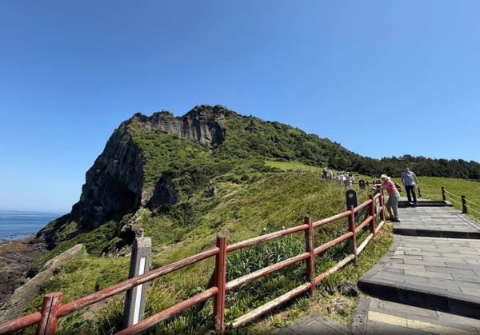

- **11h – Manjanggul Lava Tube** 만장굴 (UNESCO, ~2h) – tube de lave spectaculaire
> 🚗 *Depuis Seongsan Ilchulbong :* ~15 min de route

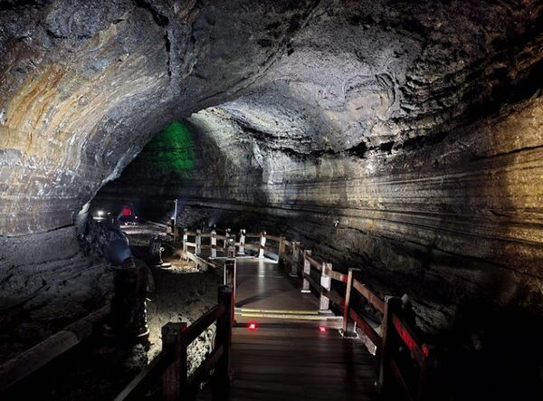

### Après-midi (14h-18h)

- **14h – Jeju Folk Village** 제주민속촌 (10€, ~1h30) – [Maps](https://maps.app.goo.gl/VAnWbXSTrfHKrMyL9)
> 🚗 *Depuis Manjanggul :* ~60 min de route (38 km)

> **Optionnel – Seongeup Folk Village** 성읍민속마을 – village authentique gratuit, à faire **avant** Jeju Folk Village si on part tôt (~44 min depuis Manjanggul, puis 16 min vers Jeju Folk Village) – [Maps](https://maps.app.goo.gl/6ZiU2fKXxMMGm3fZ7)

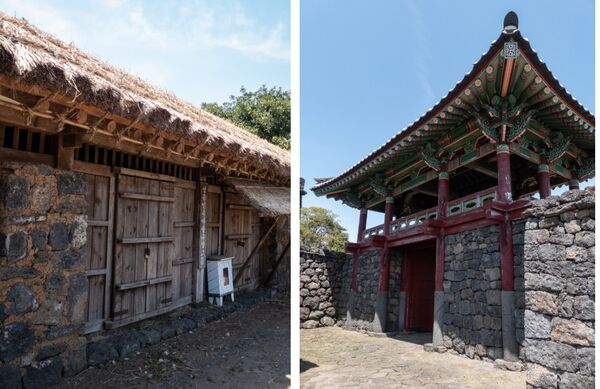
> 🚗 *Depuis Seongeup :* ~10 min de route

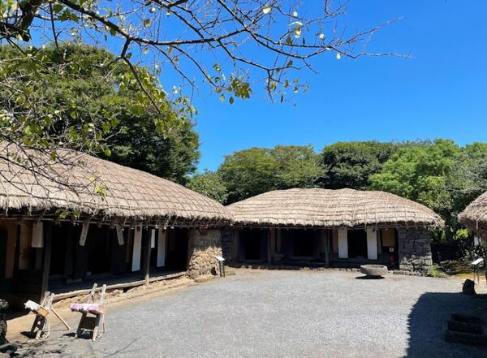

### Soirée (~17h)
- 🚗 Route vers hébergement Seogwipo (~1h) · check-in · balade bord de mer

---

## Jour 16 – Jeju : Randonnée Hallasan (demi-journée) + cascades 🥾

### Matin (6h30-11h) – Départ tôt

- **7h – Randonnée Hallasan** 한라산 – les deux sentiers montent au même point : **Witseoreum** 윗세오름 (1700m, pas le sommet). Choisir l'un des trois formats :

  **Option A — Sentier Yeongsil** 영실탐방로 ⭐ recommandé
  Paysage volcanique dramatique : colonnes de lave "500 Generals" 오백나한, vue spectaculaire sur le cratère et la côte. Escaliers en bois et chemin de pierres bien entretenus. **17.1km aller-retour · D+ 846m · 6-7h**
  > ⚠️ Réservation obligatoire : [visithalla.jeju.go.kr](https://visithalla.jeju.go.kr)
  > 🗺️ [Tracé & photos AllTrails (311 avis · 4.7⭐)](https://www.alltrails.com/trail/south-korea/jeju/yeongsil-trail) · [VisitKorea](https://english.visitkorea.or.kr/svc/contents/contentsView.do?vcontsId=80779) · [ℹ️ infos pratiques](https://www.koreatriptips.com/en/tourist-attractions/1769098.html)
  > 🅿️ Parking gratuit au trailhead · 📍 246 Yeongsil-ro, Seogwipo-si · 🚻 Toilettes au Yeongsil Rest Area
  > 🕐 **Dernière entrée** : sep 14h · oct 12h · avr 14h · mai-août 15h · ⚠️ Fermeture possible par mauvais temps

https://pastefile.owl.cycloid.io/5772097237b68e79907b58dfe57c55c9.png

  **Option B — Sentier Eorimok** 어리목탐방로
  Forêt dense au départ, puis bambous nains et boardwalks en altitude. Vue panoramique sur Jeju City et le cratère d'Hallasan depuis le plateau. Difficile, nombreux escaliers (genoux en descente). **14km aller-retour · D+ 891m · 6-6.5h**
  > ✅ Pas de réservation nécessaire
  > 🗺️ [Tracé & photos AllTrails (74 avis · 4.6⭐)](https://www.alltrails.com/trail/south-korea/jeju-do/uriimok-trail)

  **Option C — Traversée Yeongsil → Eorimok** ⭐ meilleure option
  Point à point : montée par Yeongsil (boardwalk, vues spectaculaires sur la côte), descente par Eorimok (forêt, terrain plus irrégulier). Refuge Witseoreum au sommet (toilettes uniquement, pas de nourriture — prévoir tout). Taxi retour depuis parking Eorimok vers parking Yeongsil. **11.4km · D+ 677m · 4.5-5h · modéré**
  > ✅ Pas de réservation nécessaire
  > ⚠️ Heure limite d'entrée au refuge Witseoreum variable selon saison — vérifier sur place
  > 🗺️ [Tracé & photos AllTrails (160 avis · 4.7⭐)](https://www.alltrails.com/trail/south-korea/jeju/hallasan-witse-oreum-trails) · [ℹ️ info traversée (FR)](https://horizon.tirawa.com/article/dans-les-secrets-de-la-coree-du-sud-avec-grands-reportages/decouverte-de-la-partie-centrale-de-lile-de-jeju)

  > ⚠️ Départ avant 7h30 recommandé · Dernier accès trailhead fixé par le parc national
> 🚗 *Depuis hébergement Seogwipo :* ~30 min vers le trailhead Yeongsil · ~25 min vers Eorimok

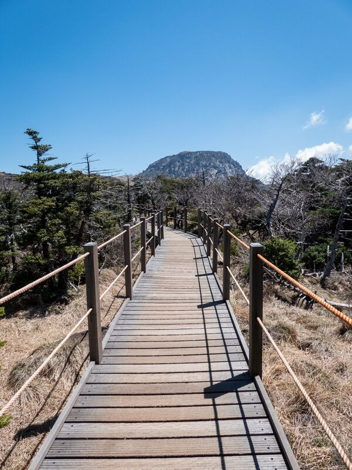

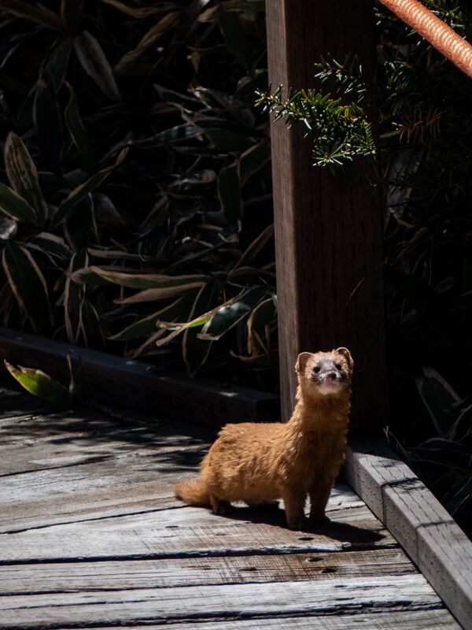

### Après-midi (13h-18h)

- **13h – Cascade Cheonjiyeon** 천지연폭포 (9h-22h, 2000 wons, ~1h) – [Maps](https://maps.app.goo.gl/LdHXEwRr8aFPnLBG7)
> 🚗 *Depuis parking trailhead / Seogwipo :* ~30 min de route

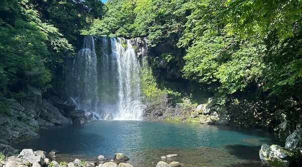

- **14h30 – Cascade Jeongbang** 정방폭포 (tombe directement dans la mer, 9h-17h30, 2000 wons, ~1h) – [Maps](https://maps.app.goo.gl/jiQ4pMc2364Anryu6)
> 🚶 *Depuis Cheonjiyeon :* ~10 min à pied

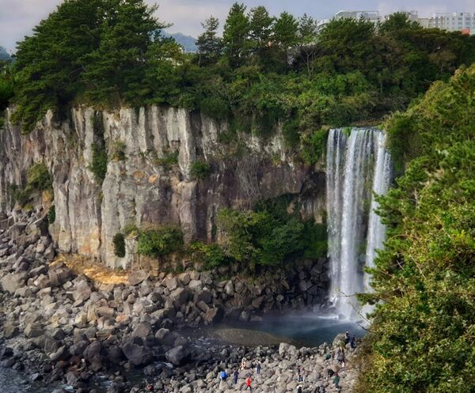

### Soirée
- Détente Seogwipo, dîner fruits de mer

---

## Jour 17 – Jeju : Jungmun (sud) → Hyeopjae (ouest) → Jeju-si (nord) 🏖️

> 🚗 Circuit en voiture : sud → ouest → nord (pas d'aller-retour)

### Matin (8h-12h) – Secteur sud (Jungmun)

- **8h15 – Jusangjeolli Cliff** 주상절리대 – colonnes de lave hexagonales (9h-17h30, 2000 wons, ~1h) – [Maps](https://maps.app.goo.gl/VjroNbsdEH33pBZJA)
> 🚗 *Depuis hébergement Seogwipo :* ~15 min de route

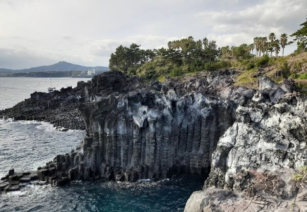

- **9h45 – Cheonjeyeon Waterfalls** 천제연폭포 (9h-17h20, 2000 wons, ~1h15) – secteur Jungmun
> 🚗 *Depuis Jusangjeolli :* ~10 min de route

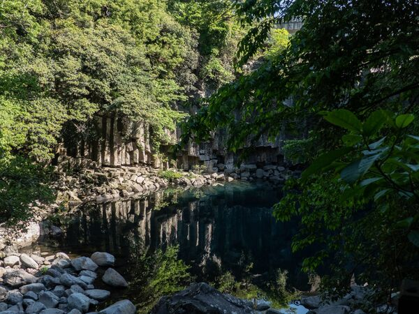

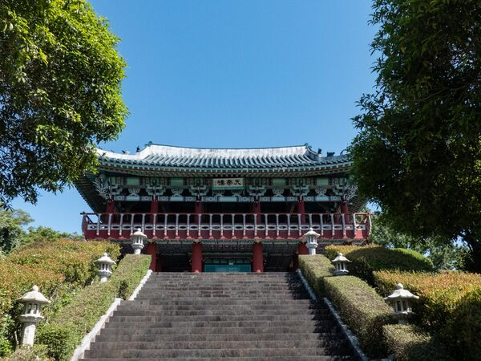

- **11h – Oedolgae** 외돌개 ou **Hwanguji Coast** 황우지해안 (piscine naturelle, ~1h)
> 🚗 *Depuis Cheonjeyeon :* ~10 min de route

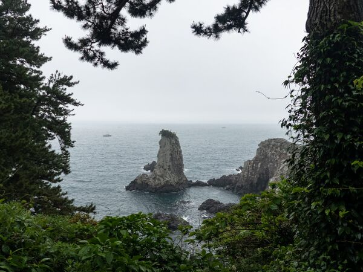

### Après-midi (13h-18h) – Route vers l'ouest puis le nord

- **14h – Plage Hyeopjae** 협재해수욕장 – sable blanc, eau turquoise (~2h) – [Maps](https://maps.app.goo.gl/ayz335y4KGZNFZ9JA)
> 🚗 *Depuis Jungmun/Oedolgae :* ~45 min de route

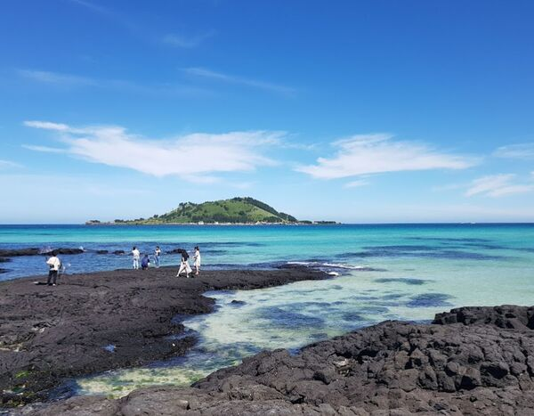

### Soirée (~16h)
- 🚗 Route vers Jeju-si (~40 min) · restitution voiture aéroport 17h · check-in hôtel 18h

> **Optionnel** : Teddy Bear Museum (Jungmun, 6€) – [Maps](https://maps.app.goo.gl/wVdK5m86eNGDkqDf8)

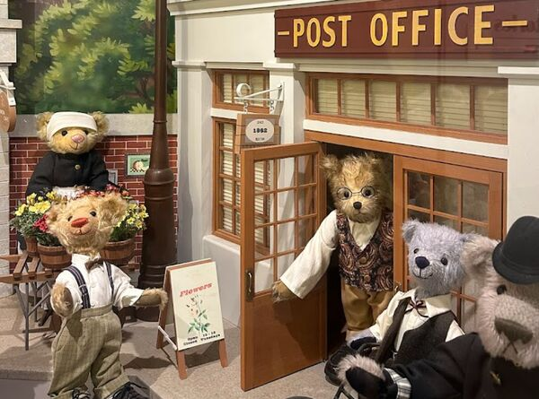


---

## Jour 18 – Jeju → Séoul ✈️

> ✈️ *Vol matinal CJU→GMP (viser 8h–9h) :* Jeju Air, Jin Air, Air Seoul 에어서울, Korean Air · **~60 min · 40 000–120 000 ₩ (~€27–€83)**
> 🚇 *Depuis GMP 김포공항 → centre Séoul :* Ligne 5 오호선 ou 공항철도 → 서울역 · **~25 min · 1 550–4 750 ₩ (~€1.10–€3.30)** selon ligne

### Après-midi (11h-18h) – Séoul

- **~11h – Dépôt bagages hôtel, déjeuner**
> 📍 *Arrivée hôtel Myeongdong depuis Seoul Station :* 🚇 Ligne 4 서울역→명동 · 2 min

- **13h – National Museum of Korea** 국립중앙박물관 — (si non fait au J8) L'un des plus grands musées d'Asie : 300 000 artefacts couvrant 5 000 ans d'histoire coréenne. Highlight : la Pagode Gyeongcheonsa (10 niveaux de pierre sculptée) et les collections de céladons de la période Goryeo. Gratuit, très bien organisé par époque. Prévoir 2-3h pour les salles permanentes. Ligne 4 station 이촌 Ichon.
> 🚇 *Depuis Myeongdong :* Ligne 4→이촌 · ~20 min · 1 550 ₩ (~€1.10)

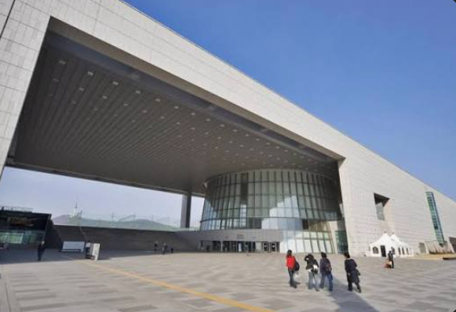

- **16h30 – Derniers achats Myeongdong / Euljiro** – souvenirs, cosmétiques, snacks (K-pop goods shops Myeongdong / Hongdae & K-Mecca)
> 🚇 *Depuis 이촌 :* Ligne 4 retour →명동 · ~20 min · 1 550 ₩ (~€1.10)

- **Star Avenue** 스타 에비뉴 (Lotte Young Plaza, Myeongdong 명동) — même concept que K-Star Road (empreintes de mains de stars, ambiance K-pop multi-agences) mais en **intérieur** dans un mall. **Redondant avec K-Star Road déjà fait en J4** — à faire uniquement si on veut du shopping K-pop dans le quartier de l'hôtel le soir.

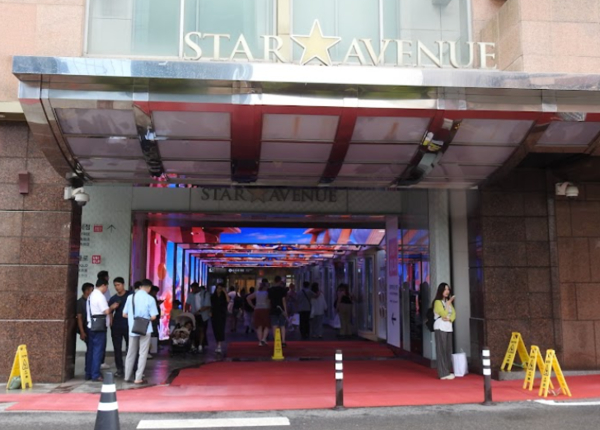

### Soirée
- **19h – Dernier dîner à Séoul** (galbi, samgyeopsal, naengmyeon) · retour hôtel · préparation bagages

---

## Jour 19 – Départ 🛫

> 🚆 *AREX depuis 서울역 Seoul Station → 인천국제공항 Incheon Airport :*
> **Express 직통** · ~43 min · 9 500 ₩ (~€6.50) (recommandé)
> ⚠️ Prévoir 3h avant vol international — départ hôtel ~6h si vol à 10h (réveil 5h30, checkout 6h, AREX 6h15 → aéroport ~6h58)

---

## 📌 Journées optionnelles (si temps libre)

Activités supplémentaires à caler selon disponibilité. Groupées par ville/zone.

---

### Jour optionnel – Séoul : musées & culture

> À caler sur un jour libre à Séoul (J8 recommandé)

- **War Memorial of Korea** 전쟁기념관 — Musée et mémorial imposant dédié à toutes les guerres coréennes de l'Antiquité à la Guerre de Corée (1950-53). En extérieur : tanks, jets, navires de guerre à taille réelle. En intérieur : reconstitutions de batailles au sol, galeries sur l'occupation japonaise et la partition. Très bien conçu, émouvant. Gratuit. Station 삼각지 Samgakji (Lignes 4 et 6).

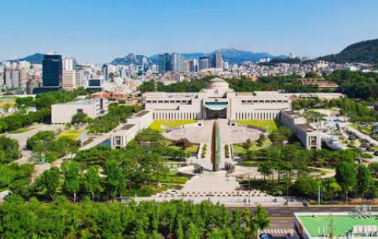

- **Lotte World Adventure** 롯데월드어드벤처 — L'un des plus grands parcs d'attractions en intérieur au monde, dans le même complexe que le Seoul Sky Tower (Jamsil). Montagnes russes, carrousels, parade. Ouvert 9h30-22h. Entrée ~€45/pers. **Avertissement : files d'attente de 1-2h pour les attractions populaires**, surtout le week-end — préférer un jour de semaine en milieu de matinée.

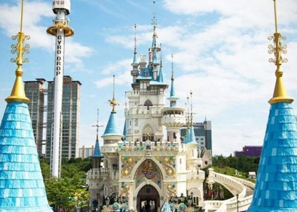

- **Leeum Samsung Museum** 리움미술관 — Musée privé d'exception à Hannam-dong (Yongsan). Art coréen traditionnel (céladons, sculptures bouddhistes) au rez-de-chaussée, art contemporain international (Damien Hirst, Andy Warhol) aux étages supérieurs. Les trois bâtiments sont signés Mario Botta, Jean Nouvel et Rem Koolhaas. ~€15/pers. Station 한강진 Hangangjin (Ligne 6).

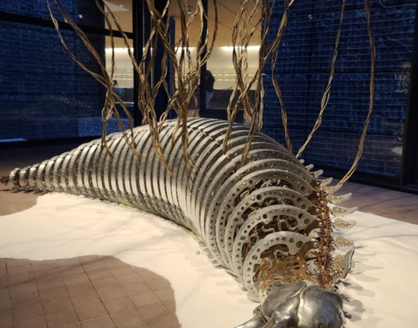

- **Rivière Han** 한강 — **Départ recommandé : Yeouido** 여의도한강공원 (le plus grand parc, location de vélos sur place ~€3-4/h, convenience stores dans le parc). Itinéraire vélo conseillé : **Yeouido → Ttukseom** (~15km, ~1h30, piste plate et balisée le long de la rive nord) — vues sur les gratte-ciel de Gangnam, passage sous les ponts. Finir à Ttukseom pour l'ambiance "chimaek" (poulet frit + bière au bord de l'eau). En soirée : si passage côté **Banpo** (à mi-chemin), le pont Banpo s'illumine avec des fontaines colorées certains soirs (vérifier le calendrier sur place). Croisière en bateau aussi possible depuis plusieurs embarcadères (~€10/pers, 1h).
> 🚇 *Depuis hôtel Myeongdong :* Ligne 5 오호선 명동 → 여의나루 Yeouinaru · **~15 min · 1 550 ₩ (~€1.10)** · Retour depuis Ttukseom : Ligne 2 이호선 뚝섬유원지 → centre Séoul · ~25 min

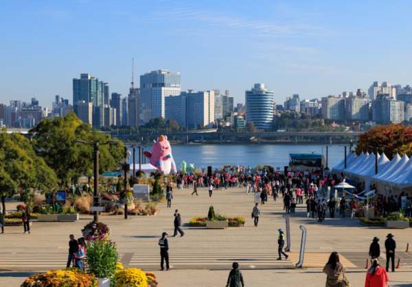

- **Eunpyeong Hanok Village** 은평한옥마을 — Village hanok contemporain construit depuis 2015 dans le nord-ouest de Séoul, avec les crêtes de Bukhansan en arrière-plan. Moins fréquenté que Bukchon, plus aéré, boutiques d'artisanat et salons de thé traditionnel. À 15 min de bus depuis la station 연신내 Yeonsinnae (Ligne 3/6). Vue remarquable sur la montagne depuis les ruelles en pente. – [Maps](https://maps.app.goo.gl/Hu6aGTzjLFJjJAGw9)

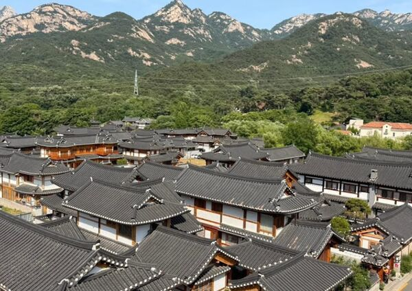

- **Temple Jinkwansa** 진관사 — Temple bouddhiste actif au pied de Bukhansan, fondé au XIe siècle. Connu pour avoir abrité des documents du mouvement d'indépendance coréen cachés dans un drapeau bouddhiste (découverts en 2009). Entouré de forêt, très paisible, bien moins fréquenté que les temples du centre-ville. Magnifique en automne. À combiner avec une randonnée Bukhansan légère depuis la même zone. – [Maps](https://maps.app.goo.gl/ybsbsksCvzP3pMmA9)

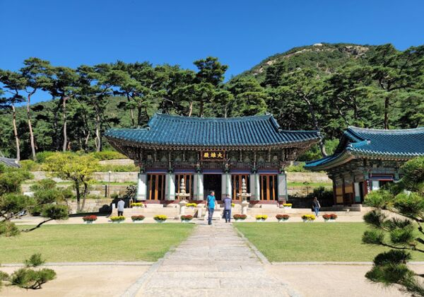

- **Palais Changgyeonggung** 창경궁 — Quatrième palais de la dynastie Joseon, construit en 1484, adjacent à Changdeokgung (les deux partagent un mur). Converti en zoo par les Japonais pendant l'occupation, restauré en palais en 1983. Ouvert jusqu'à **21h** (illuminé la nuit), fermé le lundi. Entrée ~€1. Idéal en soirée si J2 (Changdeokgung) était trop chargé, ou pour une balade nocturne dans les jardins. – [Maps](https://maps.app.goo.gl/rEHcUpouJJAXN7179)

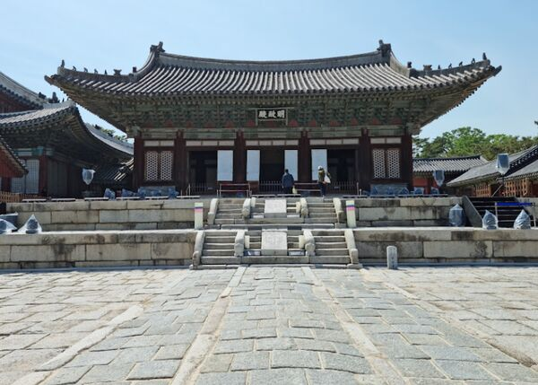

- **Village mural de Jidong** (street art, Suwon) – côté est de la forteresse, **2.9 km / ~25 min à pied** depuis Haenggungdong — à faire uniquement si on démarre Suwon avant 8h ou si on racourcire la partie Séoul fin de journée (J3) – [Maps](https://maps.app.goo.gl/qKUokYYz6WT6n1Bx9)

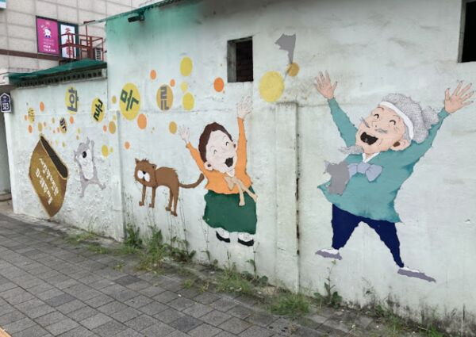

---

### Jour optionnel – Excursion Chuncheon (depuis Séoul)

> Train ITX depuis Wangsimni (~1h, 5€). Faisable à la journée.

- **Téléphérique de Chuncheon** 춘천 케이블카 — Cabine en verre traversant le lac Uiam (~17€ A/R) avec vue sur le plan d'eau cerné de montagnes boisées. L'un des rares téléphériques urbains en Corée. Bus 16 depuis la gare de Chuncheon ou taxi. Durée traversée ~5 min, prévoir 1h avec attente et photos.

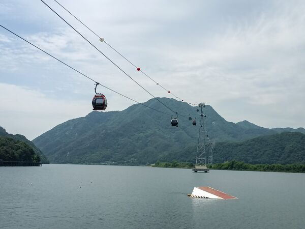

- **Voie verte** 자전거길 — Sentier pédestre et cyclable longeant la rivière Bukhan à travers la ville. À l'extrémité : un "Skywalk" (passerelle avec plancher en verre) suspendu au-dessus de la rivière, vue vertigineuse sur le canyon. Gratuit, très agréable en automne avec les feuillages.

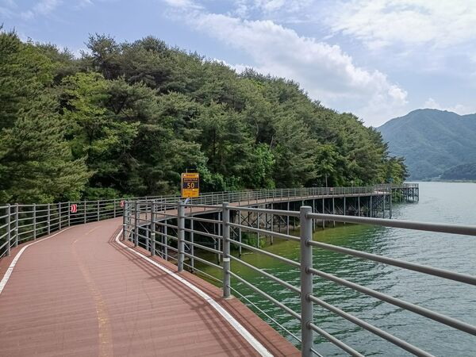

- **Mont Samaksan** 삼악산 — 654m, randonnée de 3-4h aller-retour classée modérée-difficile sur une crête rocheuse avec vues panoramiques. En contrebas, le temple Heungguksa (興國寺) mérite un arrêt. Entrée du parc : bus 7 depuis le terminal de Chuncheon — repérer l'entrée sur Kakao Map avant de partir (le GPS Google est peu fiable ici).

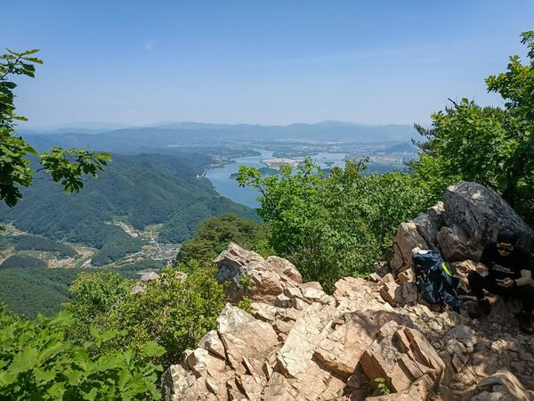

---

### Jour optionnel – Excursion DMZ (depuis Séoul)

> Journée complète, **réserver en avance** (tour organisé obligatoire pour JSA)

- **JSA (Panmunjom)** 판문점 — La zone de sécurité commune où fut signé l'armistice de 1953. Vous vous retrouvez face à face avec des soldats nord-coréens à quelques mètres, de part et d'autre de la Ligne de démarcation militaire. L'un des endroits les plus surréalistes de la planète. **Tour organisé obligatoire** (USO tour ou opérateur coréen agréé) — passeport indispensable, certaines nationalités exclues. Réserver 2-3 semaines à l'avance.

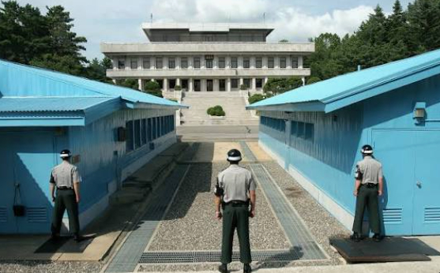

- **Tunnel d'infiltration n°3** 제3땅굴 — L'un des 4 tunnels creusés clandestinement par la Corée du Nord sous la Zone Démilitarisée, découvert en 1978. Assez large pour faire passer 30 000 soldats par heure. Descente en monorail dans la roche, casque obligatoire (plafond ~1.6m). Fait partie du circuit Dorasan, combiné avec l'observatoire Dora.

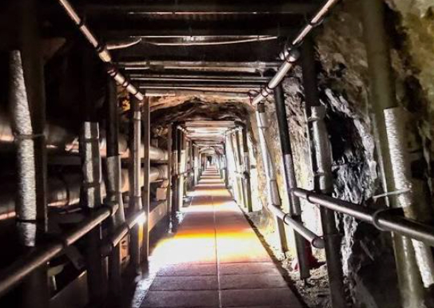

- **Observatoire Dora** 도라전망대 — Plateforme d'observation sur les hauteurs avec télescopes pointant vers la Corée du Nord. Par temps clair : vue sur la ville fantôme de Kijongdong (village de propagande nord-coréen) et les gratte-ciel de Kaesong au loin. Inclus dans les circuits DMZ standard.

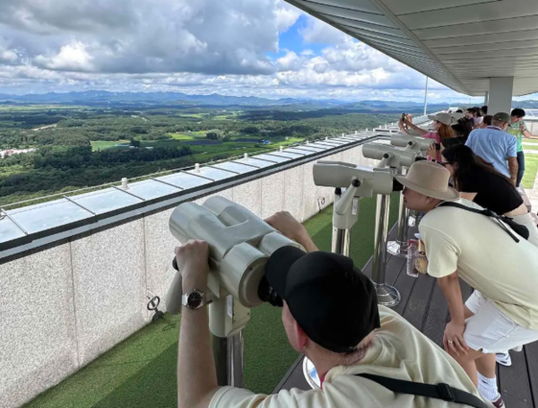

---

### Jour optionnel – Andong (depuis Séoul)

> Bus express ~2h30 depuis Séoul. Village traditionnel magnifique.

- **Village Hahoe** 하회마을 (UNESCO) — L'un des villages clan les mieux préservés de Corée, habité par la famille Ryu depuis 600 ans. Maisons à toit de chaume et tuiles disposées organiquement dans un méandre de la rivière Nakdong. Classé UNESCO en 2010. Des spectacles de danse masquée Hahoe (하회탈춤) ont lieu le week-end sur la scène du village. Prévoir 3-4h pour tout explorer à pied. ~45 min en taxi depuis Andong.

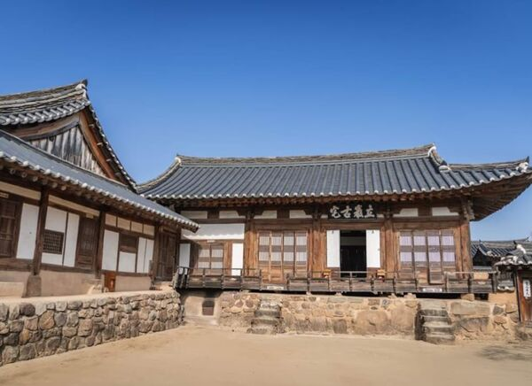

- **Bongjeongsa** 봉정사 — Temple bouddhiste abritant l'un des plus anciens bâtiments en bois de Corée : le hall Geungnakjeon, possiblement construit au XIIe-XIIIe siècle. Niché dans une forêt de montagne avec des sentiers de randonnée calmes autour. Très peu fréquenté par les touristes étrangers. Bus depuis Andong (~20 min) + 10 min à pied depuis l'arrêt.

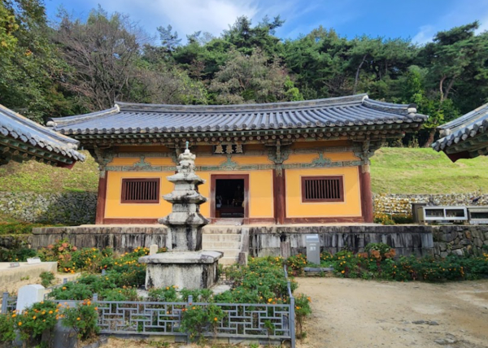

---

### Jour optionnel – Nami Island (depuis Séoul)

> Bus ~1h30 depuis Séoul. Paysage automnal spectaculaire.

- **Nami Island** 남이섬 — Île en croissant dans la rivière Bukhan, rendue célèbre mondialement par la K-drama "Winter Sonata" (2002). Allées de ginkgos, châtaigniers et pins créant des couloirs feuillus spectaculaires — **dorés en octobre**, en cerisiers en avril. Pas de voiture sur l'île. Ferry depuis l'embarcadère de Gapyeong (~5 min traversée, ~€8 A/R avec entrée). Depuis Séoul : train ITX depuis Wangsimni → Gapyeong (~1h10). Rythme tranquille, idéal pour une demi-journée de décompression. [Maps](https://maps.app.goo.gl/rsqq6wad2wyk4FVH9)

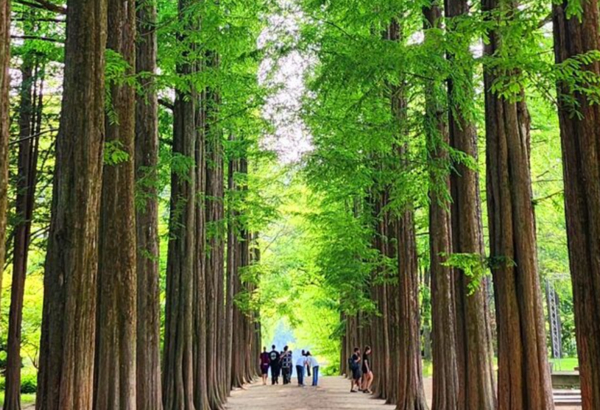


---

### Jour optionnel – Busan (extras)

> À caler si temps libre sur les jours Busan (J9-J12)

- **Dakbatgol Mural Village** 닭밭골벽화마을 — Petit village mural discret derrière Busan Station, plus intime et authentique que Gamcheon. Son nom signifie "champ de poulets" — des poules se baladent effectivement entre les ruelles. Fresques peintes par des habitants. 20-30 min à pied depuis 부산역 Busan Station. Beaucoup moins touristique, bonne alternative si Gamcheon semble trop fréquenté. – [visitbusan.net](https://www.visitbusan.net/index.do?menuCd=DOM_000000301001001000&uc_seq=2104&lang_cd=en)

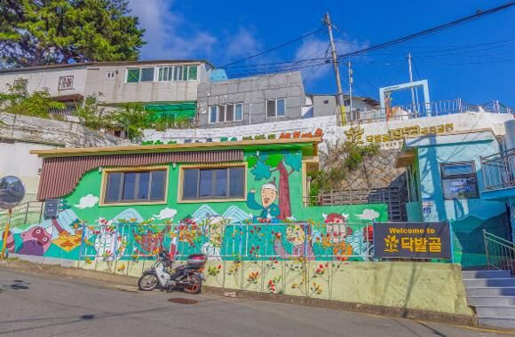

- **Hurshimchung Spa** 허심청 — L'un des plus grands jimjilbang (bains coréens) de Corée, au nord de Busan près du temple Beomeosa. Dizaines de bassins à différentes températures, saunas, bains extérieurs. Entrée ~€10, serviettes et tenues fournies. Ouvert 24h. Excellent après une longue randonnée (Igidae ou autre). Station 온천장 Oncheonjang (Ligne 1).

- **Pont Woljeong** 월정교 (Gyeongju) — Pont en bois reconstruit à l'identique du pont Silla du VIIIe siècle, enjambant la rivière Namcheon. Spectaculaire illuminé la nuit en rouge et orange. À 10 min à pied du Palais Donggung/Étang Wolji (déjà prévu en J12 soir) — facile à ajouter sur le chemin retour.

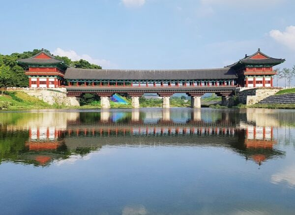

- **Village Yangdong** 양동마을 (UNESCO) — Village clan préservé similaire à Hahoe mais plus proche de Gyeongju. Plus de 200 structures Joseon dont les maisons résidentielles en bois les plus anciennes de Corée. 1h30-2h de visite. ~20 min en taxi depuis le centre de Gyeongju. À combiner avec Gyeongju si on a du temps après Bulguksa. – [Maps](https://maps.app.goo.gl/whQyggVqUd76tQXu8)

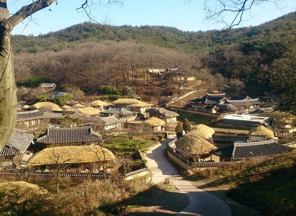

---

### Jour optionnel – Jeju (extras)

> À caler si temps libre sur les jours Jeju (J13-J16). Voiture disponible.

- **Forêt Bijarim** 비자림 — Futaie de 2 800 cyprès chinois (비자나무) âgés de 500 à 800 ans, l'une des plus grandes forêts mono-espèces de vieux arbres au monde. Sentier circulaire d'1km dans une atmosphère dense et silencieuse, sol de mousse, lumière filtrée. Très reposant tôt le matin avant la foule. Entrée ~€2. 30 min en voiture depuis Jeju-si.

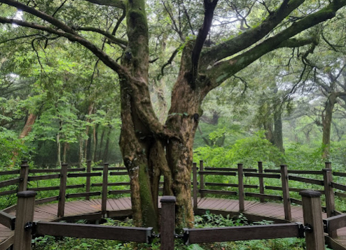

- **Villages de Haenyeo** 해녀마을 — Les haenyeo sont les plongeuses en apnée de Jeju, une tradition féminine de 1 500 ans classée UNESCO en 2016. On peut les observer travailler depuis le rivage à Udo, Sehwa ou Jongdal. Les bulteok (abris communautaires en pierre) sont leurs lieux de repos entre les plongées. Le Musée des Haenyeo (해녀박물관) près de Kimnyeong retrace leur histoire. Préférer une visite matinale pour les voir en activité.

- **Olle Trail** 제주올레 — Réseau de 26 sentiers balisés (437km au total) qui font le tour complet de l'île en longeant les côtes, falaises et villages. Chaque section fait 15-20km (5-7h). Pour une demi-journée : **section 7** (falaises de Beophwan, très photographique) ou **section 10** (côte de Hwasun, lave noire et mer). Balisage orange/bleu + symboles cheval et flèche.


- **Île d'Incheon** – Chinatown, Wolmido (1h métro depuis Séoul, à faire avant/après Jeju) [Maps](https://maps.app.goo.gl/fsK8isJz4xvM99oW9)

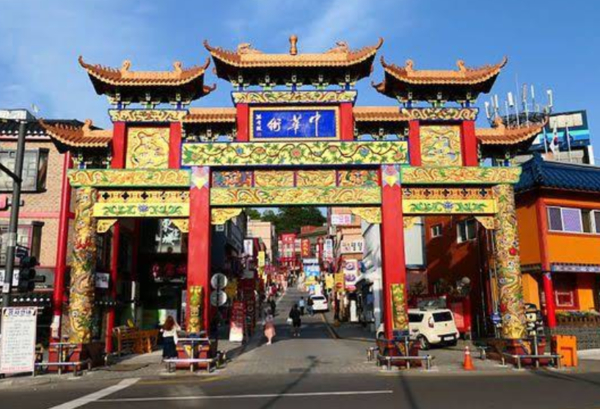